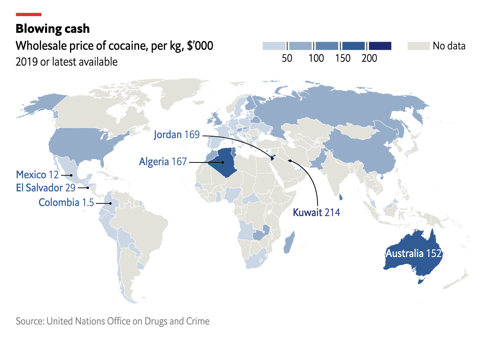

# 2022/W46: Cocaine & Heroin Prices (1990-2020)

**Data (data.world):** [https://data.world/makeovermonday/2022w46](https://data.world/makeovermonday/2022w46)

**Article / original viz:** [https://www.economist.com/graphic-detail/2022/10/25/how-much-does-cocaine-cost-around-the-world](https://www.economist.com/graphic-detail/2022/10/25/how-much-does-cocaine-cost-around-the-world)

**Original data source:** [https://dataunodc.un.org/dp-drug-prices-Europe-USA](https://dataunodc.un.org/dp-drug-prices-Europe-USA)

**Dataset:** `makeovermonday/2022w46`  
**Last updated on data.world:** 2022-11-13T18:47:11.043691292Z

---

Historical wholesale & retail prices for the USA and Western Europe

---
{"editor":"simple"}
---
## **Original Visualization**

## **References**
The Economist: [How much does cocaine cost around the world?](https://www.economist.com/graphic-detail/2022/10/25/how-much-does-cocaine-cost-around-the-world)
Data Source: UNODC [Price time series for cocaine and heroin, Western Europe and the United States](https://dataunodc.un.org/dp-drug-prices-Europe-USA)