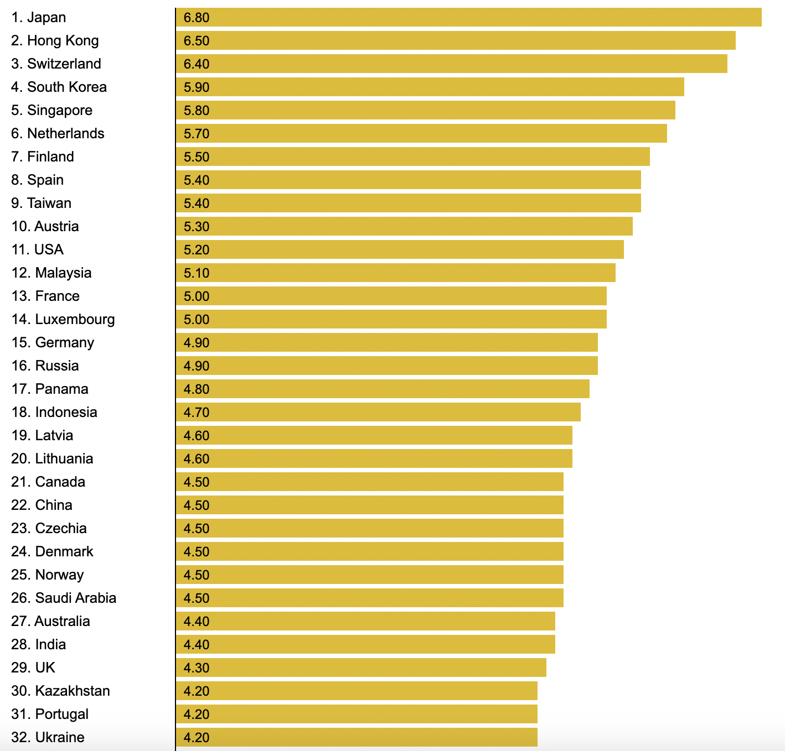

# 2022/W47: Railroad Infrastructure Quality Rankings

**Data (data.world):** [https://data.world/makeovermonday/2022w47](https://data.world/makeovermonday/2022w47)

**Article / original viz:** [https://www.theglobaleconomy.com/rankings/railroad_quality](https://www.theglobaleconomy.com/rankings/railroad_quality)

**Dataset:** `makeovermonday/2022w47`  
**Last updated on data.world:** 2022-11-20T18:15:09.328223277Z

---

Quality of railroad infrastructure, 1(low) - 7(high)

---
{"editor":"simple"}
---
## **Original Visualization**

NOTE: This is not the entire visualization. All countries are shown on the chart on the website.

​

## **Resources**
TheGlobalEconomy - [Railroad infrastructure quality - Country rankings](https://www.theglobaleconomy.com/rankings/railroad_quality/)
Data Source: World Economic Forum