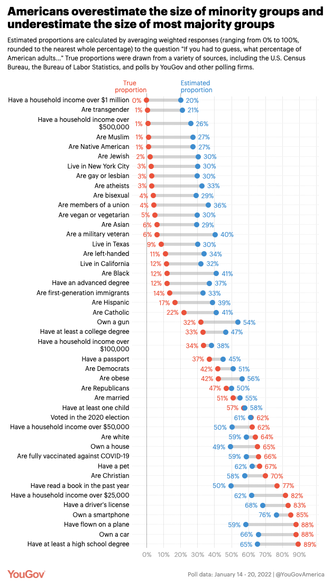

# 2022/W49: How Americans Perceive Demographics

**Data (data.world):** [https://data.world/makeovermonday/2022w49](https://data.world/makeovermonday/2022w49)

**Article / original viz:** [https://today.yougov.com/topics/politics/articles-reports/2022/03/15/americans-misestimate-small-subgroups-population](https://today.yougov.com/topics/politics/articles-reports/2022/03/15/americans-misestimate-small-subgroups-population)

**Dataset:** `makeovermonday/2022w49`  
**Last updated on data.world:** 2022-12-05T09:02:23.301779810Z

---

Americans were asked "If you had to guess, what percentage of American adults..."

---
{"editor":"simple"}
---
## **Original Visualization**

## **Resources**
Original article and data - [YouGovAmerica](https://today.yougov.com/topics/politics/articles-reports/2022/03/15/americans-misestimate-small-subgroups-population)