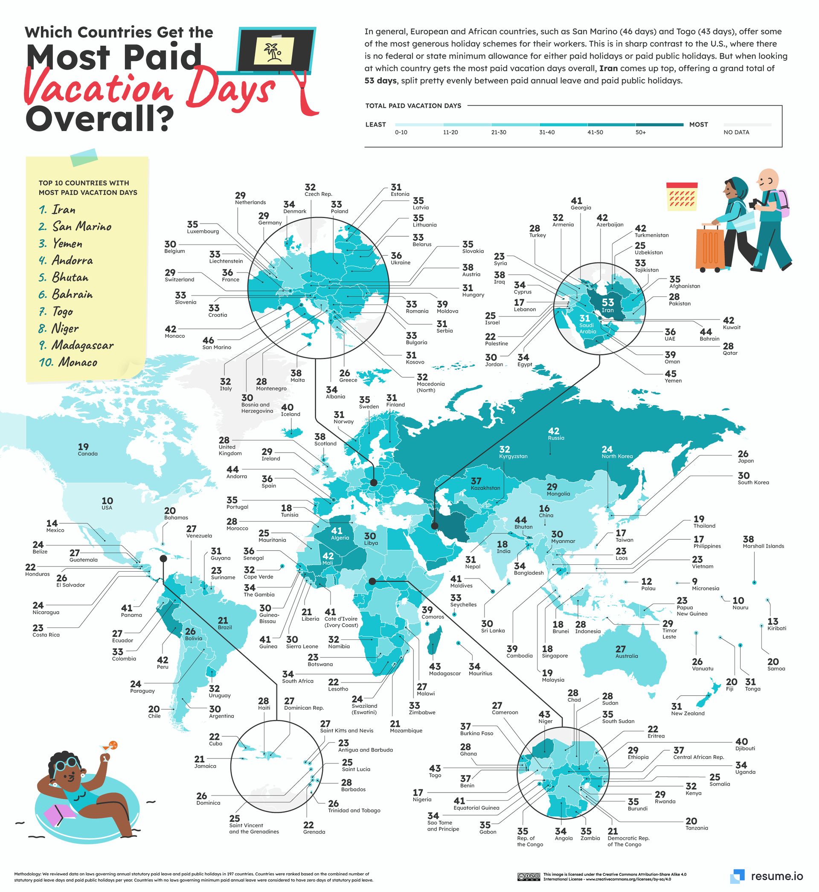

# 2022/W50: Which country gets the most paid vacation days?

**Data (data.world):** [https://data.world/makeovermonday/2022w50](https://data.world/makeovermonday/2022w50)

**Article / original viz:** [https://resume.io/blog/which-country-gets-the-most-paid-vacation-days](https://resume.io/blog/which-country-gets-the-most-paid-vacation-days)

**Original data source:** [https://twitter.com/VIZMIXER](https://twitter.com/VIZMIXER)

**Dataset:** `makeovermonday/2022w50`  
**Last updated on data.world:** 2022-12-11T16:04:49.141996522Z

---

Which country gets the most paid vacation days?

---
{"editor":"simple"}
---
## Original Visualization

​

## Resources
Data Source: [Resume.io](https://resume.io/blog/which-country-gets-the-most-paid-vacation-days)
Data collected and prepared by: [Yamil Medina](https://twitter.com/VIZMIXER) (please tag him)