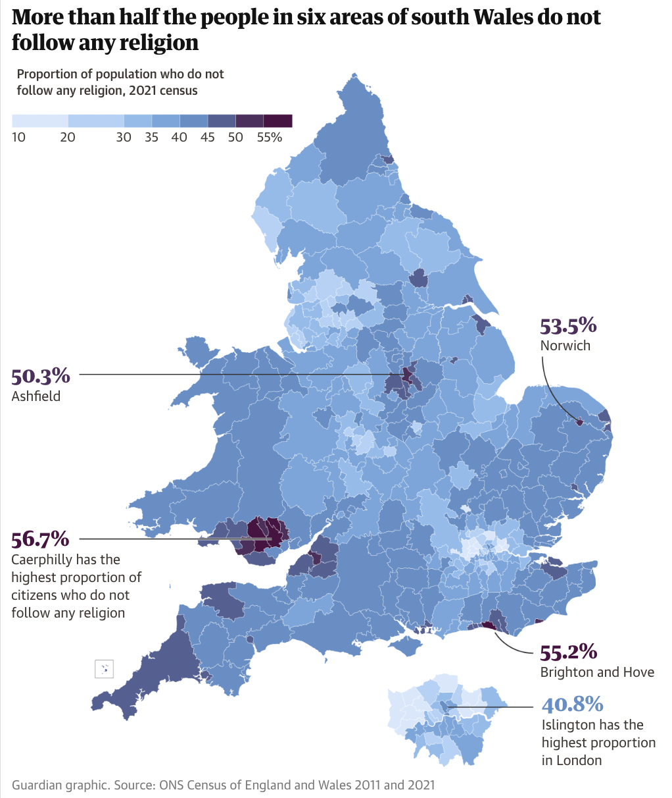

# 2022/W51: Religious Affiliation in the UK - 2011 vs. 2021

**Data (data.world):** [https://data.world/makeovermonday/2022w51](https://data.world/makeovermonday/2022w51)

**Article / original viz:** [https://www.theguardian.com/uk-news/2022/nov/29/census-2021-in-charts-christianity-now-minority-religion-in-england-and-wales?CMP=Share_iOSApp_Other](https://www.theguardian.com/uk-news/2022/nov/29/census-2021-in-charts-christianity-now-minority-religion-in-england-and-wales?CMP=Share_iOSApp_Other)

**Original data source:** [https://census.gov.uk](https://census.gov.uk)

**Dataset:** `makeovermonday/2022w51`  
**Last updated on data.world:** 2022-12-19T15:36:55.994248070Z

---

Religious Affiliation in the UK - 2011 vs. 2021

---
{"editor":"simple"}
---
# Original Viz

​

# Resources
[UK religions](https://www.theguardian.com/uk-news/2022/nov/29/census-2021-in-charts-christianity-now-minority-religion-in-england-and-wales?CMP=Share_iOSApp_Other)
Data Source: [UK Census](https://census.gov.uk/) (England only)