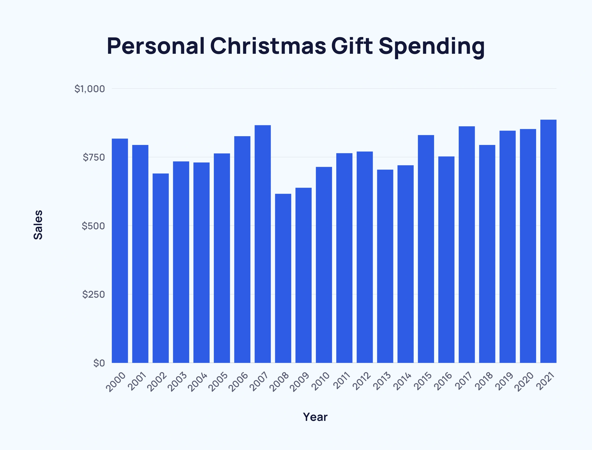

# 2022/W52: Average holiday Spending by Americans

**Data (data.world):** [https://data.world/makeovermonday/2022w52](https://data.world/makeovermonday/2022w52)

**Article / original viz:** [https://explodingtopics.com/blog/christmas-spending-stats](https://explodingtopics.com/blog/christmas-spending-stats)

**Original data source:** [https://explodingtopics.com/blog/christmas-spending-stats](https://explodingtopics.com/blog/christmas-spending-stats)

**Dataset:** `makeovermonday/2022w52`  
**Last updated on data.world:** 2022-12-26T09:18:58.345955835Z

---

Average holiday spending over time by gift recipient

---
{"editor":"simple"}
---
## **Original Visualization**

​

## **Resources**
Data Source: [Exploding Topics](https://explodingtopics.com/blog/christmas-spending-stats)