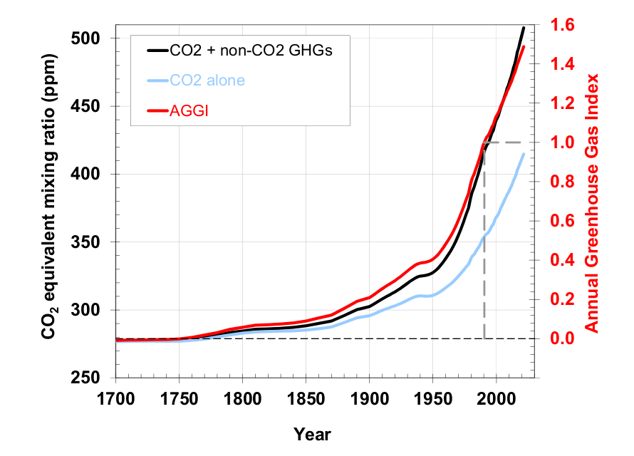

# 2023/W1: Global Radiative Forcing

**Data (data.world):** [https://data.world/makeovermonday/2023w1](https://data.world/makeovermonday/2023w1)

**Article / original viz:** [https://gml.noaa.gov/aggi/aggi.html](https://gml.noaa.gov/aggi/aggi.html)

**Original data source:** [https://gml.noaa.gov/aggi/aggi.html](https://gml.noaa.gov/aggi/aggi.html)

**Dataset:** `makeovermonday/2023w1`  
**Last updated on data.world:** 2023-01-03T15:29:26.113565354Z

---

The NOAA Annual Greenhouse Gas Index (AGGI)

---
{"editor":"simple"}
---
## **Original Visualization**

​

## **Resources**
Article: [NOAA Global Monitoring Laboratory](https://gml.noaa.gov/aggi/aggi.html)
Data Source: [NOAA Global Monitoring Laboratory](https://gml.noaa.gov/aggi/aggi.html)