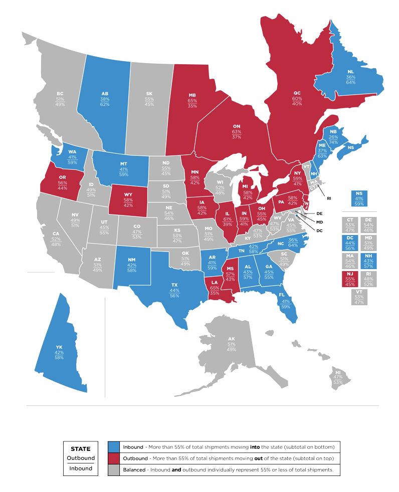

# 2023/W3: Interstate and Cross-Border 2022 Migration Patterns

**Data (data.world):** [https://data.world/makeovermonday/2023w3](https://data.world/makeovermonday/2023w3)

**Article / original viz:** [https://www.atlasvanlines.com/resources/migration-patterns](https://www.atlasvanlines.com/resources/migration-patterns)

**Dataset:** `makeovermonday/2023w3`  
**Last updated on data.world:** 2023-01-14T12:05:01.189210838Z

---

US & Canada Interstate and Cross-Border 2022 Migration Patterns

---
{"editor":"simple"}
---
## **Original Visualization**

​

## **Resources**
Article: [Interstate and Cross-Border 2022 Migration Patterns](https://www.atlasvanlines.com/resources/migration-patterns)
Data Source: Atlas Van Lines