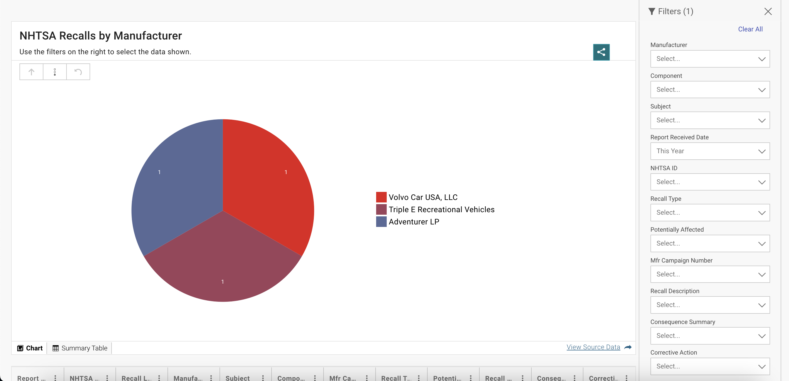

# 2023/W4: NHTSA Automobile Recalls

**Data (data.world):** [https://data.world/makeovermonday/2023w4](https://data.world/makeovermonday/2023w4)

**Article / original viz:** [https://datahub.transportation.gov/Automobiles/NHTSA-Recalls-by-Manufacturer/mu99-t4jn](https://datahub.transportation.gov/Automobiles/NHTSA-Recalls-by-Manufacturer/mu99-t4jn)

**Original data source:** [https://datahub.transportation.gov/Automobiles/Recalls-Data/6axg-epim](https://datahub.transportation.gov/Automobiles/Recalls-Data/6axg-epim)

**Dataset:** `makeovermonday/2023w4`  
**Last updated on data.world:** 2023-01-22T07:32:38.521848619Z

---

---
{"editor":"simple"}
---
## **Original Visualization**

​

## **Resources**
Source Article: [National Highway Traffic Safety Administration Automobile Recalls](https://datahub.transportation.gov/Automobiles/NHTSA-Recalls-by-Manufacturer/mu99-t4jn)
Data Source: [National Highway Traffic Safety Administration](https://datahub.transportation.gov/Automobiles/Recalls-Data/6axg-epim)