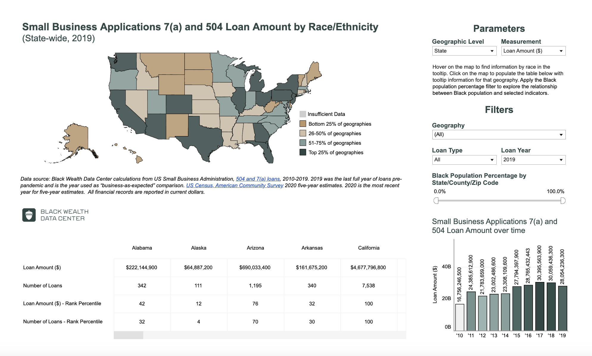

# 2023/W6: Small Business Applications and Loan Amounts

**Data (data.world):** [https://data.world/makeovermonday/2023w6](https://data.world/makeovermonday/2023w6)

**Article / original viz:** [https://blackwealthdata.org/explore/business](https://blackwealthdata.org/explore/business)

**Original data source:** [https://data.sba.gov/dataset/7-a-504-foia](https://data.sba.gov/dataset/7-a-504-foia)

**Dataset:** `makeovermonday/2023w6`  
**Last updated on data.world:** 2023-02-05T17:32:43.686066573Z

---

---
{"editor":"simple"}
---
## **Original Visualization**

​

## **Resources**
[Small Business Applications and Loan Amounts by Race/Ethnicity](https://blackwealthdata.org/explore/business)
Data Source: [U.S. Small Business Administration](https://data.sba.gov/dataset/7-a-504-foia)