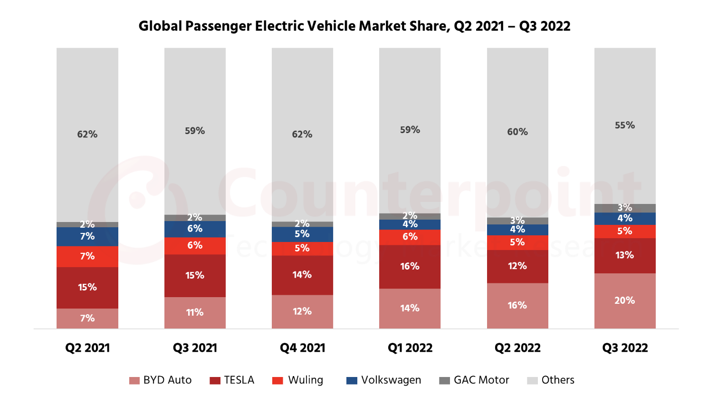

# 2023/W7: Global Electric Vehicle Market Share

**Data (data.world):** [https://data.world/makeovermonday/2023w7](https://data.world/makeovermonday/2023w7)

**Article / original viz:** [https://www.counterpointresearch.com/global-electric-vehicle-market-share/](https://www.counterpointresearch.com/global-electric-vehicle-market-share/)

**Original data source:** [https://www.counterpointresearch.com/global-electric-vehicle-market-share/](https://www.counterpointresearch.com/global-electric-vehicle-market-share/)

**Dataset:** `makeovermonday/2023w7`  
**Last updated on data.world:** 2023-02-12T20:33:58.390074857Z

---

---
{"editor":"simple"}
---
## **Original Visualization**

​

## **Resources**
[Global Electric Vehicle Market Share](https://www.counterpointresearch.com/global-electric-vehicle-market-share/)
Data Source: [Counterpoint Research](https://www.counterpointresearch.com/global-electric-vehicle-market-share/)

​