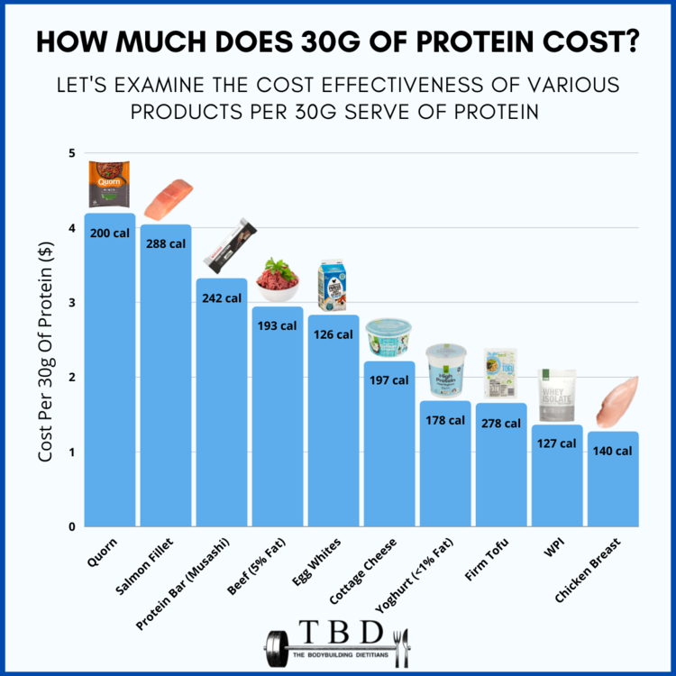

# 2023/W8: The Cheapest Ways to Get Your Protein

**Data (data.world):** [https://data.world/makeovermonday/2023w8](https://data.world/makeovermonday/2023w8)

**Article / original viz:** [https://lifehacker.com/the-cheapest-ways-to-get-your-protein-right-now-1850001760](https://lifehacker.com/the-cheapest-ways-to-get-your-protein-right-now-1850001760)

**Original data source:** [https://lifehacker.com/the-cheapest-ways-to-get-your-protein-right-now-1850001760](https://lifehacker.com/the-cheapest-ways-to-get-your-protein-right-now-1850001760)

**Dataset:** `makeovermonday/2023w8`  
**Last updated on data.world:** 2023-02-19T18:14:04.416108854Z

---

The Cheapest Ways to Get Your Protein

---
{"editor":"simple"}
---
## **Original Visualization**

​

## **Resources**
Article/Data Source: [LifeHacker](https://lifehacker.com/the-cheapest-ways-to-get-your-protein-right-now-1850001760)

Visualization: [The Bodybuilding Dietitians](https://www.thebodybuildingdietitians.com/blog/how-cost-effective-is-your-high-protein-diet)