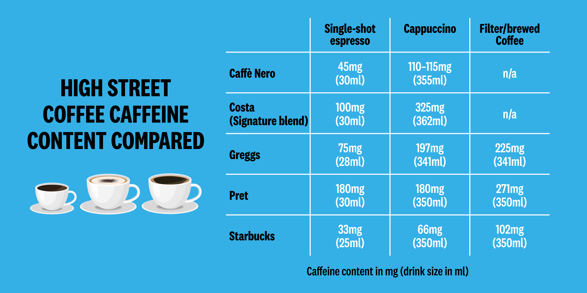

# 2023/W9: High Street Coffee Caffeine Content

**Data (data.world):** [https://data.world/makeovermonday/2023w9](https://data.world/makeovermonday/2023w9)

**Article / original viz:** [https://www.which.co.uk/news/article/caffeine-levels-in-high-street-coffees-vary-significantly-which-finds-ay7cA4G1zh1S](https://www.which.co.uk/news/article/caffeine-levels-in-high-street-coffees-vary-significantly-which-finds-ay7cA4G1zh1S)

**Original data source:** [https://www.which.co.uk/](https://www.which.co.uk/)

**Dataset:** `makeovermonday/2023w9`  
**Last updated on data.world:** 2023-02-26T09:55:22.944672056Z

---

How much caffeine is in coffee drinks at popular UK chains?

---
{"editor":"simple"}
---
## **Original Visualization**

​

## **Resources**
Data Source: [Which?](https://www.which.co.uk/)