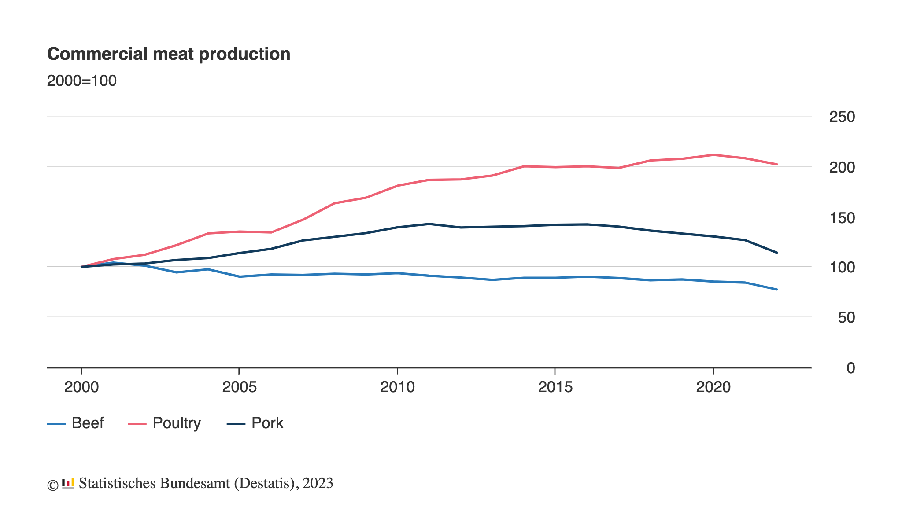

# 2023/W10: Meat Production in Germany

**Data (data.world):** [https://data.world/makeovermonday/2023w10](https://data.world/makeovermonday/2023w10)

**Article / original viz:** [https://www.destatis.de/EN/Press/2023/02/PE23_051_413.html](https://www.destatis.de/EN/Press/2023/02/PE23_051_413.html)

**Original data source:** [https://www.destatis.de/EN/FactsFigures/EconomicSectors/AgricultureForestryFisheries/AnimalsAnimalProduction/Tables/2NumberOfSlaughteredAnimals.html](https://www.destatis.de/EN/FactsFigures/EconomicSectors/AgricultureForestryFisheries/AnimalsAnimalProduction/Tables/2NumberOfSlaughteredAnimals.html)

**Dataset:** `makeovermonday/2023w10`  
**Last updated on data.world:** 2023-03-05T12:40:24.280983593Z

---

Meat production down 8.1% in 2022

---
{"editor":"simple"}
---
## **Original Visualization**

​

## **Resources**
Article: [Meat production in Germany](https://www.destatis.de/EN/Press/2023/02/PE23_051_413.html)
Data Source: [Federal Statistical Office](https://www.destatis.de/EN/FactsFigures/EconomicSectors/AgricultureForestryFisheries/AnimalsAnimalProduction/Tables/2NumberOfSlaughteredAnimals.html)

​