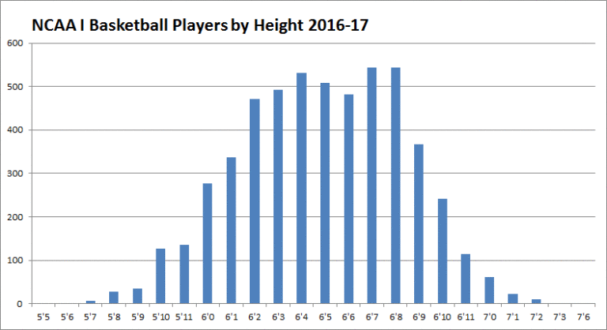

# 2023/W11: The Height of Women's Basketball Teams

**Data (data.world):** [https://data.world/makeovermonday/2023w11](https://data.world/makeovermonday/2023w11)

**Article / original viz:** [https://scholarshipstats.com/ncaa1basketball](https://scholarshipstats.com/ncaa1basketball)

**Original data source:** [https://merrill.umd.edu/directory/derek-willis](https://merrill.umd.edu/directory/derek-willis)

**Dataset:** `makeovermonday/2023w11`  
**Last updated on data.world:** 2023-03-13T12:12:57.513512776Z

---

How tall are women basketball players on each NCAA team?

---
{"editor":"simple"}
---
## **Original Visualization**

​

## **Resources**
Original Article: [Scholarship Stats](https://scholarshipstats.com/ncaa1basketball) | [Tweet](https://twitter.com/derekwillis/status/1600946516272861185)
Data Source: [Derek Willis](https://merrill.umd.edu/directory/derek-willis) via [Sports Data Analysis & Visualization class 
@merrillcollege](https://app.testudo.umd.edu/soc/202208/JOUR/JOUR479X) • Data on [github](https://github.com/Sports-Roster-Data/womens-college-basketball)
Courtesy: Data is Plural