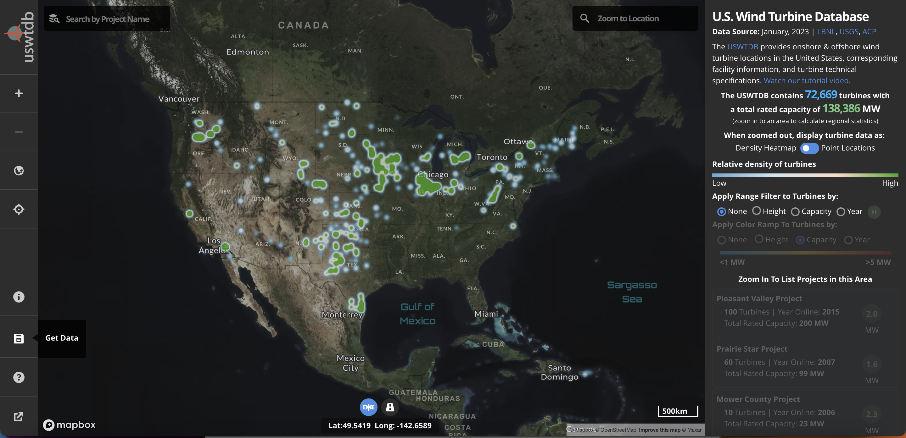

# 2023/W12: US Wind Turbines

**Data (data.world):** [https://data.world/makeovermonday/2023w12](https://data.world/makeovermonday/2023w12)

**Article / original viz:** [https://eerscmap.usgs.gov/uswtdb/viewer/#3/37.25/-96.25](https://eerscmap.usgs.gov/uswtdb/viewer/#3/37.25/-96.25)

**Original data source:** [https://eerscmap.usgs.gov/uswtdb/data/](https://eerscmap.usgs.gov/uswtdb/data/)

**Dataset:** `makeovermonday/2023w12`  
**Last updated on data.world:** 2023-03-20T02:38:48.984707066Z

---

Locations of wind turbines in the US, wind project information, and turbine technical specifications

---
{"editor":"simple"}
---
## **Original Visualization**

​

## **Resources**
Visualization: [U.S. Wind Turbines](https://eerscmap.usgs.gov/uswtdb/viewer/#3/37.25/-96.25)
Data Source: [U.S. Wind Turbine Database](https://eerscmap.usgs.gov/uswtdb/data/) | [Metadata](https://eerscmap.usgs.gov/uswtdb/api-doc/#keyValue) | [About](https://eerscmap.usgs.gov/uswtdb/)