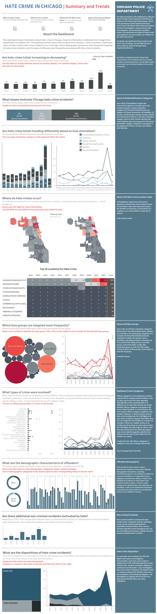

# 2023/W14: Hate Crime in Chicago

**Data (data.world):** [https://data.world/makeovermonday/2023w14](https://data.world/makeovermonday/2023w14)

**Article / original viz:** [https://home.chicagopolice.org/statistics-data/data-dashboards/hate-crime-dashboard/](https://home.chicagopolice.org/statistics-data/data-dashboards/hate-crime-dashboard/)

**Original data source:** [https://twitter.com/ZachBowders](https://twitter.com/ZachBowders)

**Dataset:** `makeovermonday/2023w14`  
**Last updated on data.world:** 2023-04-02T19:46:21.690265269Z

---

Data about hate crimes in Chicago from the Chicago Police Department

---
{"editor":"simple"}
---
# Original Viz

​

Data Source: Chicago Police Department

Collaboration with [Zach Bowders](https://twitter.com/ZachBowders)