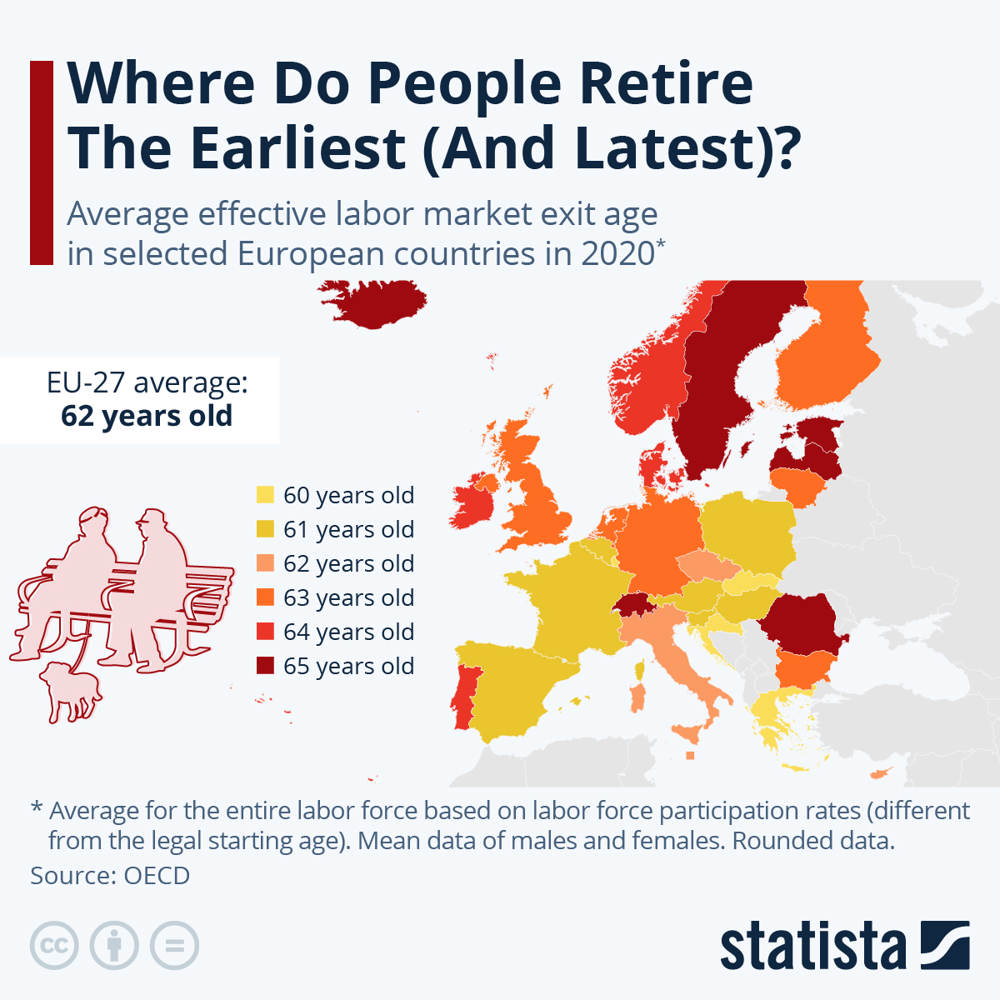

# 2023/W16: Retirement Ages Around the World

**Data (data.world):** [https://data.world/makeovermonday/2023w16](https://data.world/makeovermonday/2023w16)

**Article / original viz:** [https://www.statista.com/chart/29570/european-average-effective-labor-market-exit-ages/](https://www.statista.com/chart/29570/european-average-effective-labor-market-exit-ages/)

**Original data source:** [https://www.oecd.org/employment/emp/average-effective-age-of-labour-market-exit.htm](https://www.oecd.org/employment/emp/average-effective-age-of-labour-market-exit.htm)

**Dataset:** `makeovermonday/2023w16`  
**Last updated on data.world:** 2023-04-17T09:04:33.390451321Z

---

At what age to people retire around the World?

---
{"editor":"simple"}
---
# Original Visualization

​

# Resources
Original Article - [Statista](https://www.statista.com/chart/29570/european-average-effective-labor-market-exit-ages/)
Data Source - [OECD](https://stats.oecd.org/Index.aspx?QueryId=111940)

​