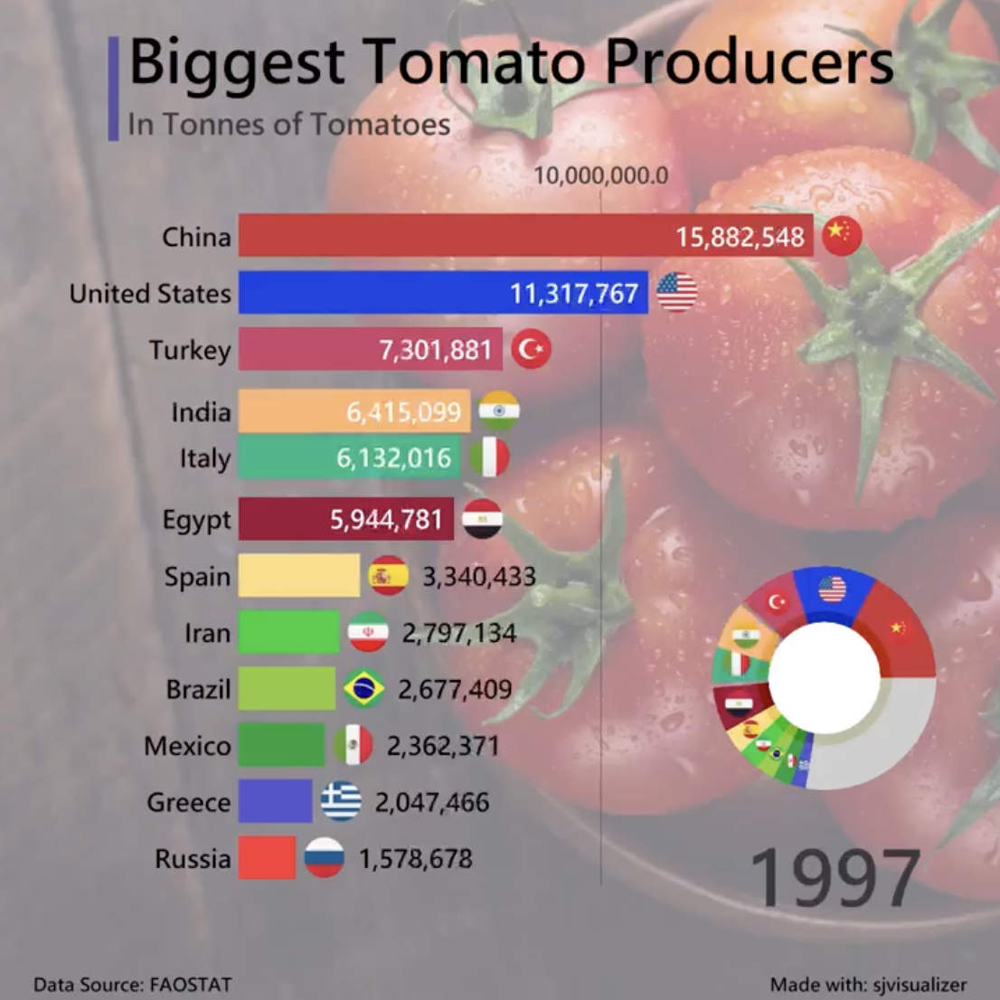

# 2023/W17: Biggest Tomato & Potato Producers

**Data (data.world):** [https://data.world/makeovermonday/2023w17](https://data.world/makeovermonday/2023w17)

**Article / original viz:** [https://www.linkedin.com/feed/update/urn:li:activity:7038221922265915394](https://www.linkedin.com/feed/update/urn:li:activity:7038221922265915394)

**Original data source:** [https://www.fao.org/faostat/en/#data/QCL](https://www.fao.org/faostat/en/#data/QCL)

**Dataset:** `makeovermonday/2023w17`  
**Last updated on data.world:** 2023-04-23T19:10:37.316025642Z

---

Production of tomatoes and potatoes by country

---
{"editor":"simple"}
---
# Original Visualization

​

# Resources
Original viz - [Sjoerd Tilmans via LinkedIn](https://www.linkedin.com/feed/update/urn:li:activity:7038221922265915394/)

Data Source: [FAOSTAT](https://www.fao.org/faostat/en/#data/QCL)