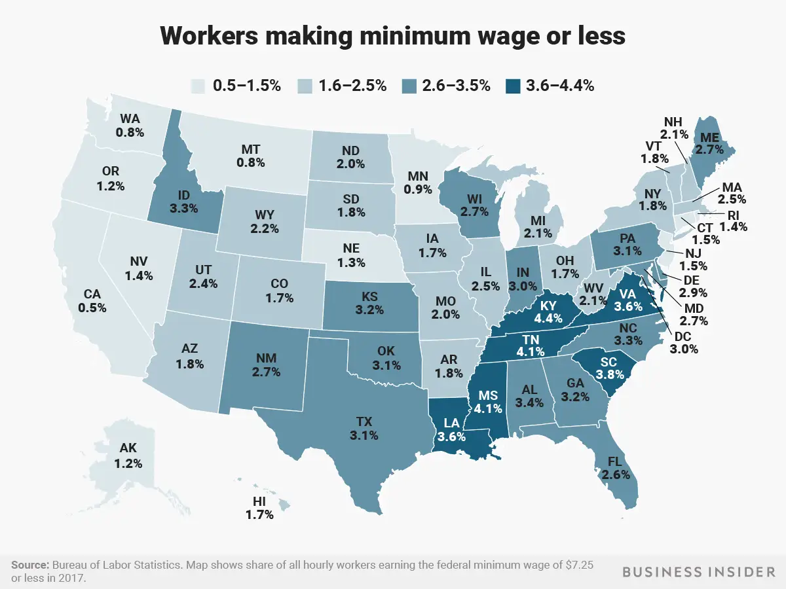

# 2023/W18: Federal minimum wage by State

**Data (data.world):** [https://data.world/makeovermonday/2023w18](https://data.world/makeovermonday/2023w18)

**Article / original viz:** [https://www.businessinsider.com/federal-minimum-wage-workers-map-2018-10?r=US&IR=T](https://www.businessinsider.com/federal-minimum-wage-workers-map-2018-10?r=US&IR=T)

**Original data source:** [https://www.bls.gov/opub/reports/minimum-wage/2021/home.htm](https://www.bls.gov/opub/reports/minimum-wage/2021/home.htm)

**Dataset:** `makeovermonday/2023w18`  
**Last updated on data.world:** 2023-05-01T08:49:08.922902930Z

---

How many people earned the Federal minimum wage or less in each State?

---
{"editor":"simple"}
---
# Original Visualization

​

# Resources
Chart Source/Article: [Insider](https://www.businessinsider.com/federal-minimum-wage-workers-map-2018-10?r=US&IR=T)

Data source: [Bureau of Labor Statistics](https://www.bls.gov/opub/reports/minimum-wage/2021/home.htm)