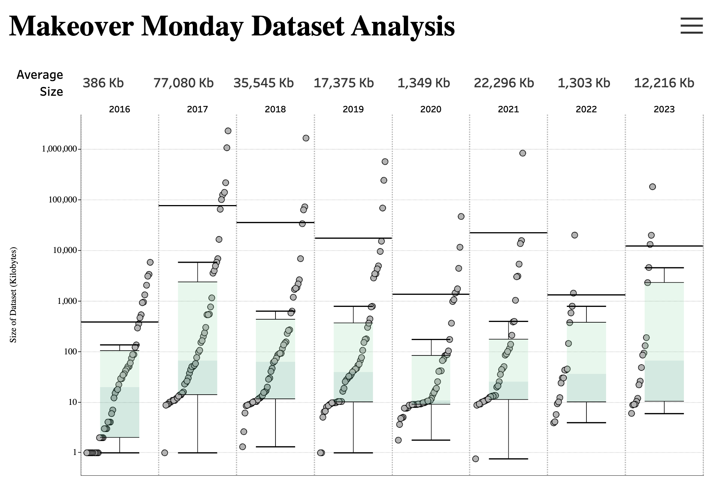

# 2023/W19: Makeover Monday Metadata Analysis

**Data (data.world):** [https://data.world/makeovermonday/2023w19](https://data.world/makeovermonday/2023w19)

**Article / original viz:** [https://public.tableau.com/app/profile/alexander.taylor.jackson/viz/MakeoverMondayDataAnalysis/MakeoverMondayDataAnalysis](https://public.tableau.com/app/profile/alexander.taylor.jackson/viz/MakeoverMondayDataAnalysis/MakeoverMondayDataAnalysis)

**Original data source:** [https://www.linkedin.com/in/alexander-taylor-jackson-b4ab36140/](https://www.linkedin.com/in/alexander-taylor-jackson-b4ab36140/)

**Dataset:** `makeovermonday/2023w19`  
**Last updated on data.world:** 2023-05-09T17:27:33.883869340Z

---

The properties of Makeover Monday data sets

---
{"editor":"simple"}
---
# Original Viz

​

# Resources
Original Viz: [Makeover Monday Metadata Analysis](https://public.tableau.com/app/profile/alexander.taylor.jackson/viz/MakeoverMondayDataAnalysis/MakeoverMondayDataAnalysis)
Data Source: [Alex Taylor-Jackson](https://www.linkedin.com/in/alexander-taylor-jackson-b4ab36140/)