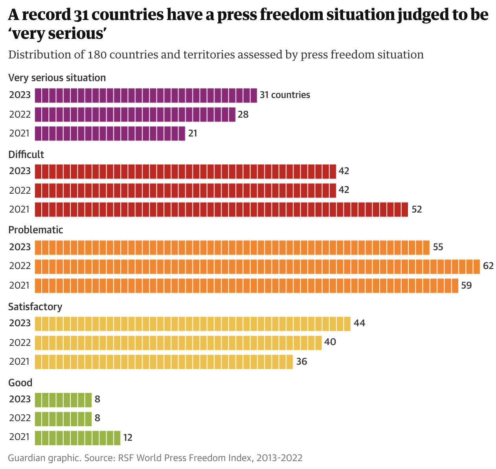

# 2023/W20: Global Media Freedom

**Data (data.world):** [https://data.world/makeovermonday/2023w20](https://data.world/makeovermonday/2023w20)

**Article / original viz:** [https://www.theguardian.com/media/2023/may/03/media-freedom-in-dire-state-in-record-number-of-countries-report-finds?CMP=Share_iOSApp_Other](https://www.theguardian.com/media/2023/may/03/media-freedom-in-dire-state-in-record-number-of-countries-report-finds?CMP=Share_iOSApp_Other)

**Dataset:** `makeovermonday/2023w20`  
**Last updated on data.world:** 2023-05-15T08:28:23.060908008Z

---

How free is the press around the World?

---
{"editor":"simple"}
---
# Original Viz

​

# Resources
Original Article: [The Guardian](https://www.theguardian.com/media/2023/may/03/media-freedom-in-dire-state-in-record-number-of-countries-report-finds?CMP=Share_iOSApp_Other)
Datasource: [Reporters Without Borders](https://rsf.org/en/index?year=2023)