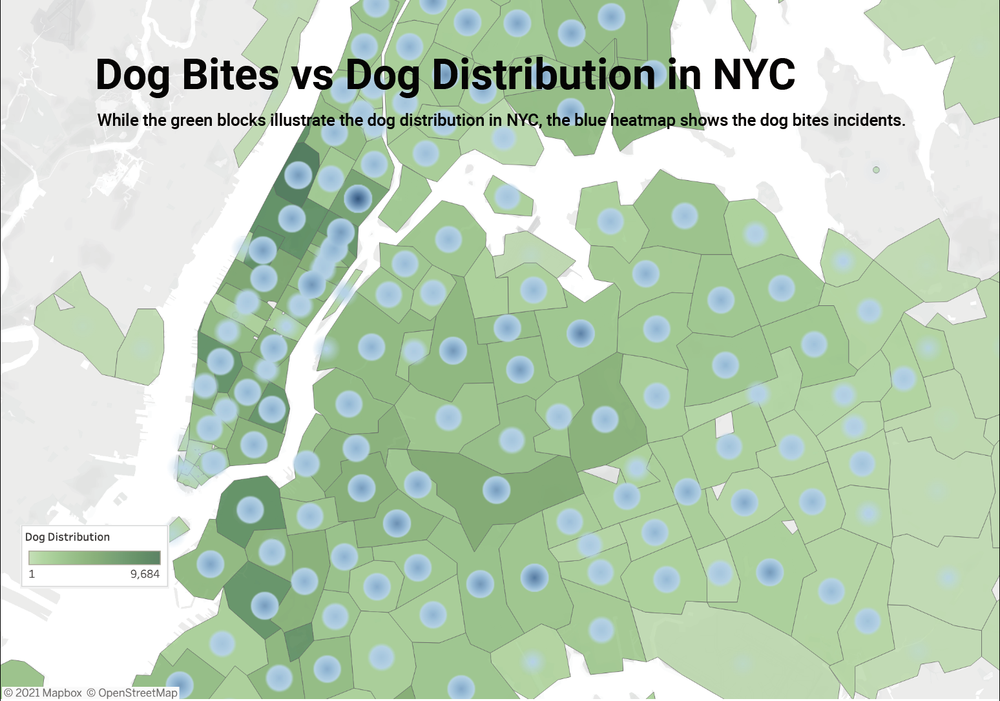

# 2023/W22: Dog Bites in New York

**Data (data.world):** [https://data.world/makeovermonday/2023w22](https://data.world/makeovermonday/2023w22)

**Article / original viz:** [https://studentwork.prattsi.org/infovis/visualization/dog-breeds-data-visualization/](https://studentwork.prattsi.org/infovis/visualization/dog-breeds-data-visualization/)

**Original data source:** [https://data.cityofnewyork.us/Health/DOHMH-Dog-Bite-Data/rsgh-akpg](https://data.cityofnewyork.us/Health/DOHMH-Dog-Bite-Data/rsgh-akpg)

**Dataset:** `makeovermonday/2023w22`  
**Last updated on data.world:** 2023-05-29T08:49:33.121117387Z

---

Dog Bites in New York

---
{"editor":"simple"}
---
# Original Visualization

​

# Resources
Original Article: [Dog Bites in NYC](https://studentwork.prattsi.org/infovis/visualization/dog-breeds-data-visualization/)
Data Sources:
• Dog Bites ([NYC Open Data](https://data.cityofnewyork.us/Health/DOHMH-Dog-Bite-Data/rsgh-akpg) )
• Dog Licensing ([NYC Open Data](https://data.cityofnewyork.us/Health/NYC-Dog-Licensing-Dataset/nu7n-tubp))