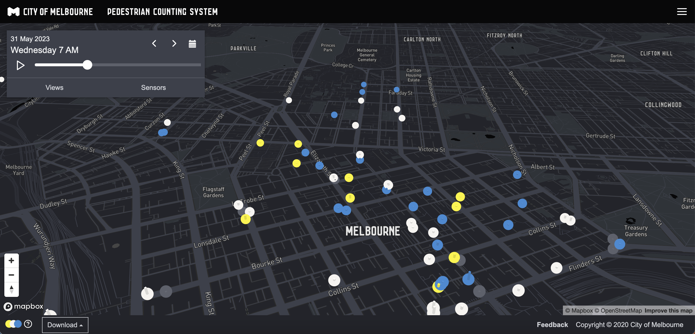

# 2023/W23: Melbourne Pedestrian Counters

**Data (data.world):** [https://data.world/makeovermonday/2023w23](https://data.world/makeovermonday/2023w23)

**Article / original viz:** [http://www.pedestrian.melbourne.vic.gov.au/#date=02-01-2019&time=6](http://www.pedestrian.melbourne.vic.gov.au/#date=02-01-2019&time=6)

**Original data source:** [https://melbournetestbed.opendatasoft.com/explore/dataset/pedestrian-counting-system-monthly-counts-per-hour/information/](https://melbournetestbed.opendatasoft.com/explore/dataset/pedestrian-counting-system-monthly-counts-per-hour/information/)

**Dataset:** `makeovermonday/2023w23`  
**Last updated on data.world:** 2023-06-04T07:23:58.056531604Z

---

Tracking pedestrians in Melbourne, Australia

---
{"editor":"simple"}
---
# Original Visualization

# Resources
[Melbourne's Pedestrian Counting System
](http://www.pedestrian.melbourne.vic.gov.au/#date=02-01-2019&time=6)Data source: [City of Melbourne](https://melbournetestbed.opendatasoft.com/explore/dataset/pedestrian-counting-system-monthly-counts-per-hour/information/)