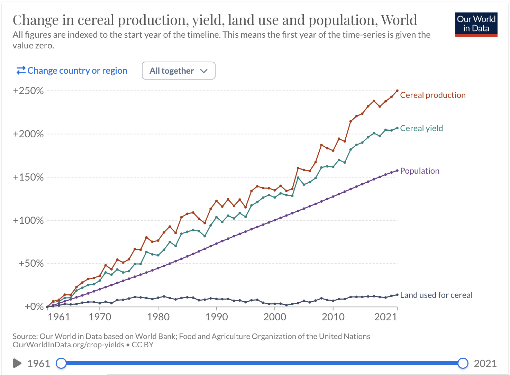

# 2023/W24: Global cereal production

**Data (data.world):** [https://data.world/makeovermonday/2023w24](https://data.world/makeovermonday/2023w24)

**Article / original viz:** [https://twitter.com/OurWorldInData/status/1666444983220465664](https://twitter.com/OurWorldInData/status/1666444983220465664)

**Original data source:** [https://ourworldindata.org/yields-vs-land-use-how-has-the-world-produced-enough-food-for-a-growing-population](https://ourworldindata.org/yields-vs-land-use-how-has-the-world-produced-enough-food-for-a-growing-population)

**Dataset:** `makeovermonday/2023w24`  
**Last updated on data.world:** 2023-06-11T20:46:01.858742862Z

---

Change in cereal production, yield, land use and population

---
{"editor":"simple"}
---
# Original Visualization

​

# Resources
Data Source: [Our World in Data](https://ourworldindata.org/yields-vs-land-use-how-has-the-world-produced-enough-food-for-a-growing-population)