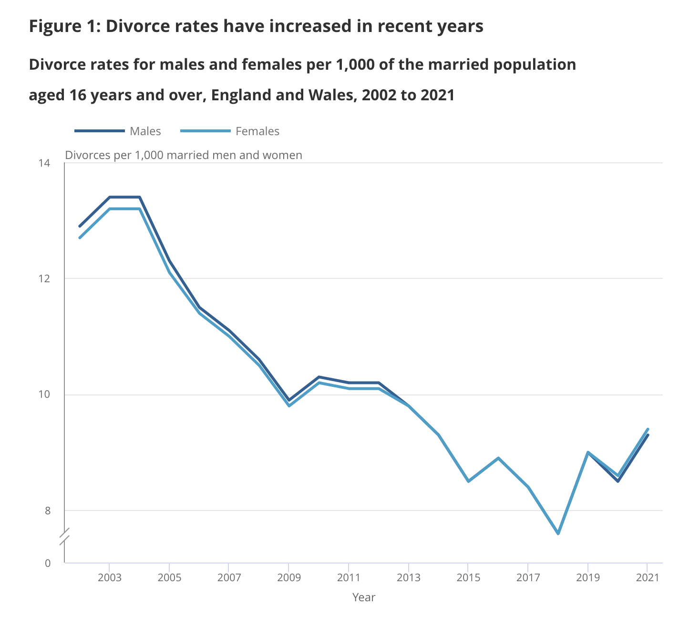

# 2023/W25: Divorces in England & Wales

**Data (data.world):** [https://data.world/makeovermonday/2023w25](https://data.world/makeovermonday/2023w25)

**Article / original viz:** [https://www.ons.gov.uk/peoplepopulationandcommunity/birthsdeathsandmarriages/divorce/bulletins/divorcesinenglandandwales/2021](https://www.ons.gov.uk/peoplepopulationandcommunity/birthsdeathsandmarriages/divorce/bulletins/divorcesinenglandandwales/2021)

**Original data source:** [https://www.ons.gov.uk/peoplepopulationandcommunity/birthsdeathsandmarriages/divorce/datasets/divorcesinenglandandwales](https://www.ons.gov.uk/peoplepopulationandcommunity/birthsdeathsandmarriages/divorce/datasets/divorcesinenglandandwales)

**Dataset:** `makeovermonday/2023w25`  
**Last updated on data.world:** 2023-06-19T07:34:37.704653876Z

---

Annual divorce numbers and rates, by duration of marriage, sex and to whom granted and reason.

---
{"editor":"simple"}
---
# Original Visualization

​

# Resources
[Divorces in England & Wales](http://divorces%20in%20england%20and%20wales/)
Data Source: [ONS](https://www.ons.gov.uk/peoplepopulationandcommunity/birthsdeathsandmarriages/divorce/datasets/divorcesinenglandandwales)