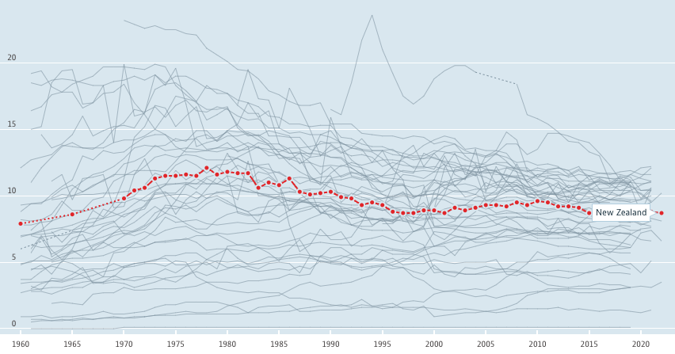

# 2023/W27: Alcohol Consumption in OECD Countries

**Data (data.world):** [https://data.world/makeovermonday/2023w27](https://data.world/makeovermonday/2023w27)

**Article / original viz:** [https://data.oecd.org/healthrisk/alcohol-consumption.htm](https://data.oecd.org/healthrisk/alcohol-consumption.htm)

**Original data source:** [https://data.oecd.org/healthrisk/alcohol-consumption.htm](https://data.oecd.org/healthrisk/alcohol-consumption.htm)

**Dataset:** `makeovermonday/2023w27`  
**Last updated on data.world:** 2023-07-03T08:20:39.278856165Z

---

Alcohol Consumption in OECD Countries

---
{"editor":"simple"}
---
## **Original Visualization**

​

## **Resources**
[OECD Alcohol consumption](https://data.oecd.org/healthrisk/alcohol-consumption.htm)
Data Source: [OECD](https://data.oecd.org/healthrisk/alcohol-consumption.htm)