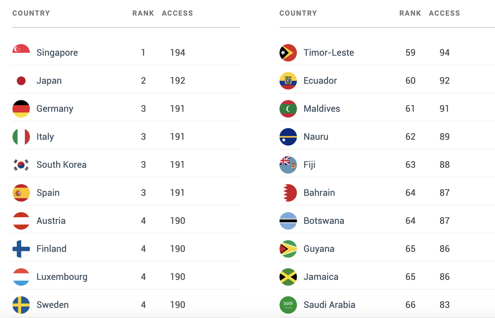

# 2023/W28: The Henley Passport Index

**Data (data.world):** [https://data.world/makeovermonday/2023w28](https://data.world/makeovermonday/2023w28)

**Article / original viz:** [https://www.henleyglobal.com/passport-index/ranking](https://www.henleyglobal.com/passport-index/ranking)

**Original data source:** [https://www.henleyglobal.com/passport-index/ranking](https://www.henleyglobal.com/passport-index/ranking)

**Dataset:** `makeovermonday/2023w28`  
**Last updated on data.world:** 2023-07-10T08:40:08.987399789Z

---

---
{"editor":"simple"}
---
# Original Visualization

​

# Resources
[The Henley Passport Index](https://www.henleyglobal.com/passport-index)
Data Source: [Henley & Partners](https://www.henleyglobal.com/passport-index)