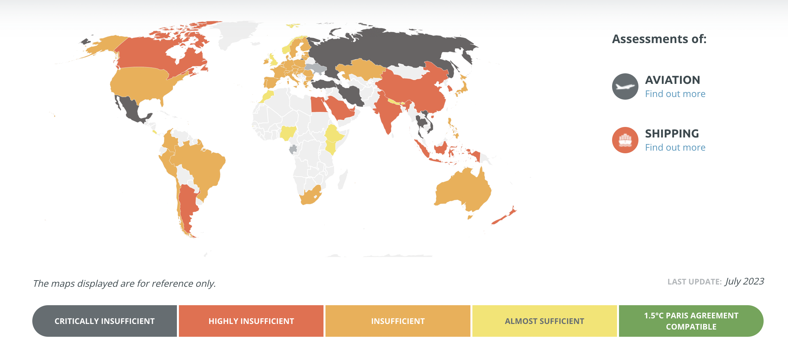

# 2023/W29: Climate Action Tracker

**Data (data.world):** [https://data.world/makeovermonday/2023w29](https://data.world/makeovermonday/2023w29)

**Article / original viz:** [https://climateactiontracker.org/](https://climateactiontracker.org/)

**Dataset:** `makeovermonday/2023w29`  
**Last updated on data.world:** 2023-07-16T11:49:20.502421545Z

---

Historical climate data for multiple factors

---
{"editor":"simple"}
---
# Original Visualization

​

# Resources
[Climate Action Tracker](https://climateactiontracker.org/)
Data Source: Climate Action Tracker