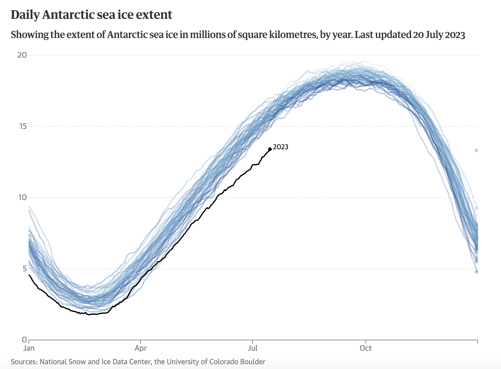

# 2023/W30: Daily sea ice extent

**Data (data.world):** [https://data.world/makeovermonday/2023w30](https://data.world/makeovermonday/2023w30)

**Article / original viz:** [https://www.theguardian.com/environment/datablog/2023/jul/20/the-climate-crisis-in-four-charts-extreme-weather-heatwaves?CMP=Share_iOSApp_Other](https://www.theguardian.com/environment/datablog/2023/jul/20/the-climate-crisis-in-four-charts-extreme-weather-heatwaves?CMP=Share_iOSApp_Other)

**Original data source:** [https://nsidc.org/data/seaice_index/data-and-image-archive](https://nsidc.org/data/seaice_index/data-and-image-archive)

**Dataset:** `makeovermonday/2023w30`  
**Last updated on data.world:** 2023-07-24T14:35:19.592118590Z

---

Daily sea ice extent

---
{"editor":"simple"}
---
# Original Visualization

​

# Resources
Article: [Daily Sea Ice Extent](https://www.theguardian.com/environment/datablog/2023/jul/20/the-climate-crisis-in-four-charts-extreme-weather-heatwaves?CMP=Share_iOSApp_Other)
Data Source: [National Snow & Ice Data Center](https://nsidc.org/data/seaice_index/data-and-image-archive)

​