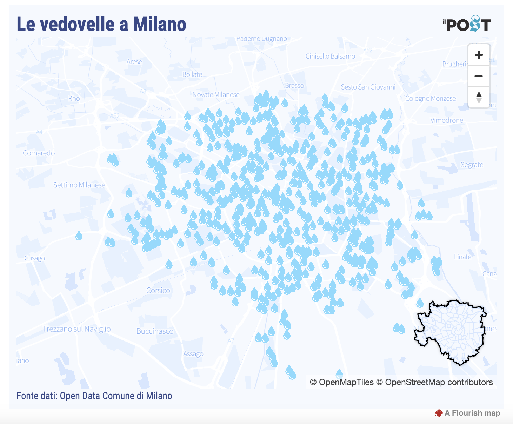

# 2023/W31: Milan Drinking Fountains

**Data (data.world):** [https://data.world/makeovermonday/2023w31](https://data.world/makeovermonday/2023w31)

**Article / original viz:** [https://www.ilpost.it/2022/06/27/fontanelle-vedovelle-milano/](https://www.ilpost.it/2022/06/27/fontanelle-vedovelle-milano/)

**Original data source:** [https://dati.comune.milano.it/it/dataset/ds502_fontanelle-nel-comune-di-milano](https://dati.comune.milano.it/it/dataset/ds502_fontanelle-nel-comune-di-milano)

**Dataset:** `makeovermonday/2023w31`  
**Last updated on data.world:** 2023-07-31T13:19:35.633308892Z

---

Milan Drinking Fountains

---
{"editor":"simple"}
---
## Original Visualization

​

## Resources
[Drinking Fountains of Milan](https://www.ilpost.it/2022/06/27/fontanelle-vedovelle-milano/)
Data Source: [Comune di Milano](https://dati.comune.milano.it/it/dataset/ds502_fontanelle-nel-comune-di-milano)