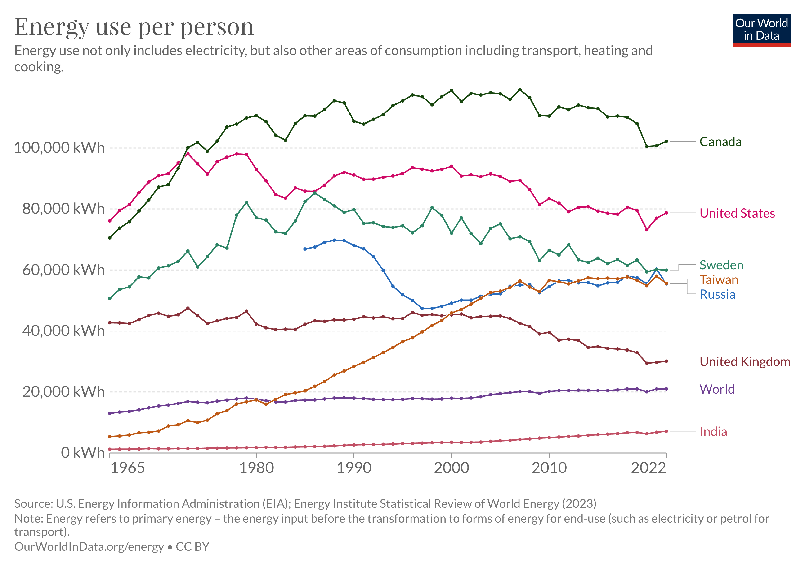

# 2023/W33: Energy Use per Person

**Data (data.world):** [https://data.world/makeovermonday/2023w33](https://data.world/makeovermonday/2023w33)

**Article / original viz:** [https://ourworldindata.org/grapher/per-capita-energy-use?tab=chart&country=IND~TWN~SWE~OWID_WRL~USA~CAN~RUS~GBR](https://ourworldindata.org/grapher/per-capita-energy-use?tab=chart&country=IND~TWN~SWE~OWID_WRL~USA~CAN~RUS~GBR)

**Original data source:** [https://ourworldindata.org/grapher/per-capita-energy-use?tab=chart&country=IND~TWN~SWE~OWID_WRL~USA~CAN~RUS~GBR](https://ourworldindata.org/grapher/per-capita-energy-use?tab=chart&country=IND~TWN~SWE~OWID_WRL~USA~CAN~RUS~GBR)

**Dataset:** `makeovermonday/2023w33`  
**Last updated on data.world:** 2023-08-14T08:22:41.479068397Z

---

---
{"editor":"simple"}
---
## **Original Visualization**

​

## **Resources**
[Energy Use per Person](https://ourworldindata.org/grapher/per-capita-energy-use?tab=chart&country=IND~TWN~SWE~OWID_WRL~USA~CAN~RUS~GBR)
Data Source: [Our World in Data](https://ourworldindata.org/grapher/per-capita-energy-use?tab=chart&country=IND~TWN~SWE~OWID_WRL~USA~CAN~RUS~GBR)