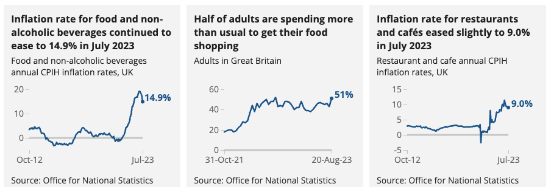

# 2023/W35: Food Inflation Rates in the UK

**Data (data.world):** [https://data.world/makeovermonday/2023w35](https://data.world/makeovermonday/2023w35)

**Article / original viz:** [https://www.ons.gov.uk/economy/inflationandpriceindices/articles/costoflivinginsights/food](https://www.ons.gov.uk/economy/inflationandpriceindices/articles/costoflivinginsights/food)

**Dataset:** `makeovermonday/2023w35`  
**Last updated on data.world:** 2023-08-28T07:41:05.805912546Z

---

---
{"editor":"simple"}
---
## Original Visualization

## Resources
[Food Inflation Rates in the UK](https://www.ons.gov.uk/economy/inflationandpriceindices/articles/costoflivinginsights/food)
Data Source: Office for Natonal Statistics