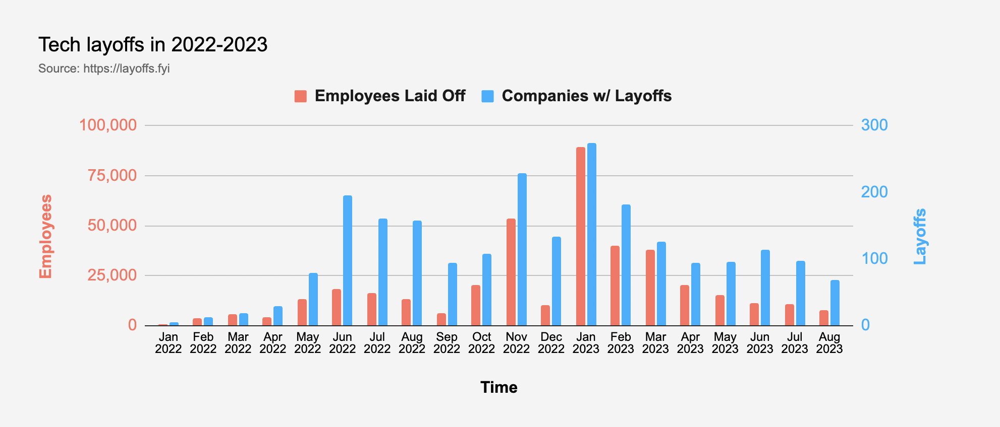

# 2023/W36: Employees at Forbes Cloud 100

**Data (data.world):** [https://data.world/makeovermonday/2023w36](https://data.world/makeovermonday/2023w36)

**Article / original viz:** [https://layoffs.fyi/](https://layoffs.fyi/)

**Original data source:** [https://twitter.com/brrosenau](https://twitter.com/brrosenau)

**Dataset:** `makeovermonday/2023w36`  
**Last updated on data.world:** 2023-09-03T14:25:29.995432173Z

---

# of employees at Fortune Cloud 100 companies: 2022-2023

---
{"editor":"simple"}
---
## **Original Visualization**

## **Resources**
Article: [Tech Layoffs](https://layoffs.fyi/)
Data Collected by: [Brittany Rosenau](https://twitter.com/brrosenau)