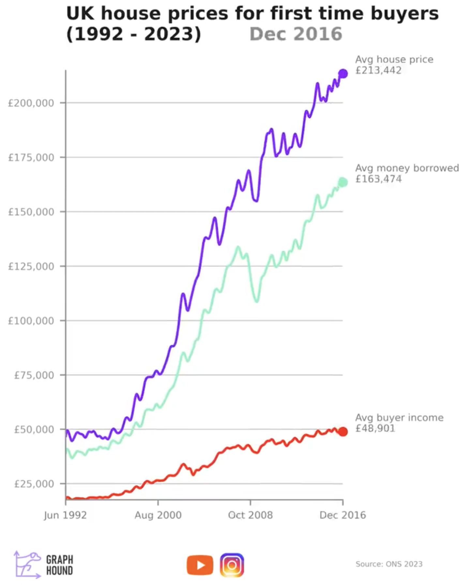

# 2023/W37: Average UK house price for first time buyers

**Data (data.world):** [https://data.world/makeovermonday/2023w37](https://data.world/makeovermonday/2023w37)

**Article / original viz:** [https://www.linkedin.com/feed/update/urn:li:activity:7103318335701803008/?utm_source=share&utm_medium=member_desktop](https://www.linkedin.com/feed/update/urn:li:activity:7103318335701803008/?utm_source=share&utm_medium=member_desktop)

**Original data source:** [https://www.ons.gov.uk/economy/inflationandpriceindices/datasets/housepriceindexmonthlyquarterlytables1to19](https://www.ons.gov.uk/economy/inflationandpriceindices/datasets/housepriceindexmonthlyquarterlytables1to19)

**Dataset:** `makeovermonday/2023w37`  
**Last updated on data.world:** 2023-09-10T10:42:01.974211531Z

---

Average UK house price for first time buyers from 1992 to 2023 compared against buyer income and money boorrowed

---
{"editor":"simple"}
---
## **Original Visualization**

​

## **Resources**
Visualization: [Average UK house price for first time buyers](https://www.linkedin.com/feed/update/urn:li:activity:7103318335701803008/?utm_source=share&utm_medium=member_desktop)
Data Source: [ONS](https://www.ons.gov.uk/economy/inflationandpriceindices/datasets/housepriceindexmonthlyquarterlytables1to19)