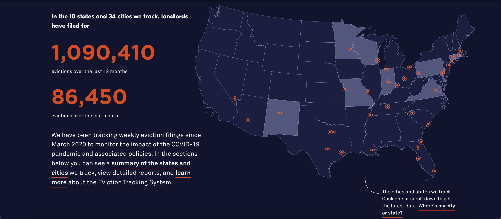

# 2023/W38: Monthly Eviction Filings in America

**Data (data.world):** [https://data.world/makeovermonday/2023w38](https://data.world/makeovermonday/2023w38)

**Article / original viz:** [https://evictionlab.org/eviction-tracking/](https://evictionlab.org/eviction-tracking/)

**Original data source:** [https://evictionlab.org/eviction-tracking/get-the-data/](https://evictionlab.org/eviction-tracking/get-the-data/)

**Dataset:** `makeovermonday/2023w38`  
**Last updated on data.world:** 2023-09-17T11:23:46.184158016Z

---

Monthly evictions for 10 states and 34 cities

---
{"editor":"simple"}
---
## Original Visualization

​

## Resources
Website: [America's Eviction Crisis](https://evictionlab.org/eviction-tracking/)
Data Source: [Eviction Lab](https://evictionlab.org/eviction-tracking/get-the-data/)