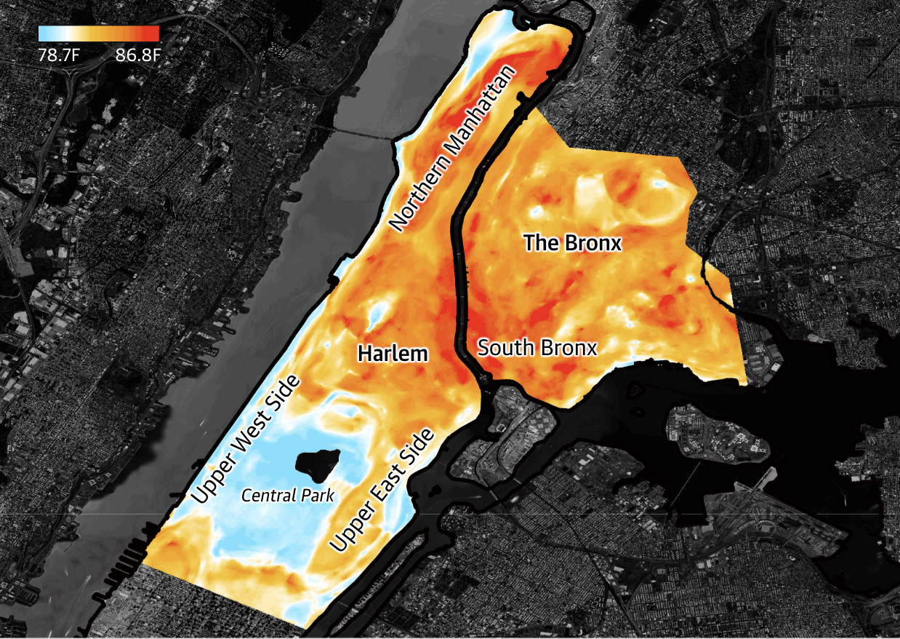

# 2023/W39: Street Level Temperatures in NYC

**Data (data.world):** [https://data.world/makeovermonday/2023w39](https://data.world/makeovermonday/2023w39)

**Article / original viz:** [https://www.theguardian.com/us-news/2022/sep/07/new-york-heat-deaths-map-inequality](https://www.theguardian.com/us-news/2022/sep/07/new-york-heat-deaths-map-inequality)

**Original data source:** [https://data.cityofnewyork.us/dataset/Hyperlocal-Temperature-Monitoring/qdq3-9eqn](https://data.cityofnewyork.us/dataset/Hyperlocal-Temperature-Monitoring/qdq3-9eqn)

**Dataset:** `makeovermonday/2023w39`  
**Last updated on data.world:** 2023-09-24T15:19:56.371194348Z

---

Street level temperature on a subset of city blocks in neighborhoods with highest heat mortality risk

---
{"editor":"simple"}
---
## **Original Visualization**

## Resources
The Guardian: [Street Level Temperatures in NYC](https://www.theguardian.com/us-news/2022/sep/07/new-york-heat-deaths-map-inequality)
Data Source: [NYC Open Data](https://data.cityofnewyork.us/dataset/Hyperlocal-Temperature-Monitoring/qdq3-9eqn)