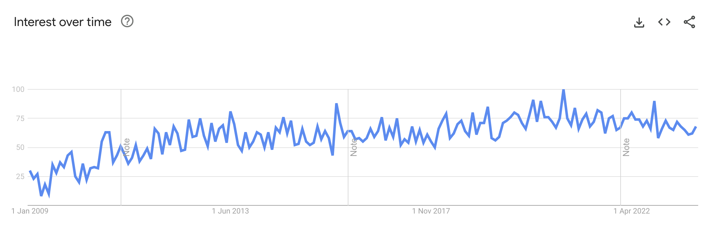

# 2023/W40: Scary Dreams in America

**Data (data.world):** [https://data.world/makeovermonday/2023w40](https://data.world/makeovermonday/2023w40)

**Article / original viz:** [https://trends.google.com/trends/explore?date=2009-01-01%202023-09-30&geo=US&q=scary%20dreams&hl=en-GB](https://trends.google.com/trends/explore?date=2009-01-01%202023-09-30&geo=US&q=scary%20dreams&hl=en-GB)

**Original data source:** [https://trends.google.com/trends/explore?date=2009-01-01%202023-09-30&geo=US&q=scary%20dreams&hl=en-GB](https://trends.google.com/trends/explore?date=2009-01-01%202023-09-30&geo=US&q=scary%20dreams&hl=en-GB)

**Dataset:** `makeovermonday/2023w40`  
**Last updated on data.world:** 2023-10-01T12:23:11.224387098Z

---

What does Google Trends tell us about scary dreams in America?

---
{"editor":"simple"}
---
## Original Visualization

​

## Resources
Data Source: [Google Trends](https://trends.google.com/trends/explore?date=2009-01-01%202023-09-30&geo=US&q=scary%20dreams&hl=en-GB)