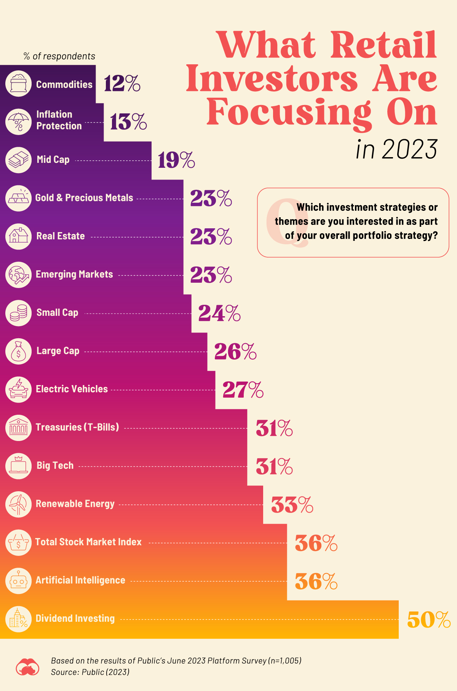

# 2023/W41: Retail Investment

**Data (data.world):** [https://data.world/makeovermonday/2023w41](https://data.world/makeovermonday/2023w41)

**Article / original viz:** [https://www.visualcapitalist.com/charted-what-are-retail-investors-interested-in-buying-in-2023/](https://www.visualcapitalist.com/charted-what-are-retail-investors-interested-in-buying-in-2023/)

**Dataset:** `makeovermonday/2023w41`  
**Last updated on data.world:** 2023-10-08T17:25:15.347557900Z

---

---
{"editor":"simple"}
---
## **Original Visualization**

## **Resources**
Article: [What are Retail Investors Interested in Buying in 2023?](https://www.visualcapitalist.com/charted-what-are-retail-investors-interested-in-buying-in-2023/)
Data Source: Visual Capitalist