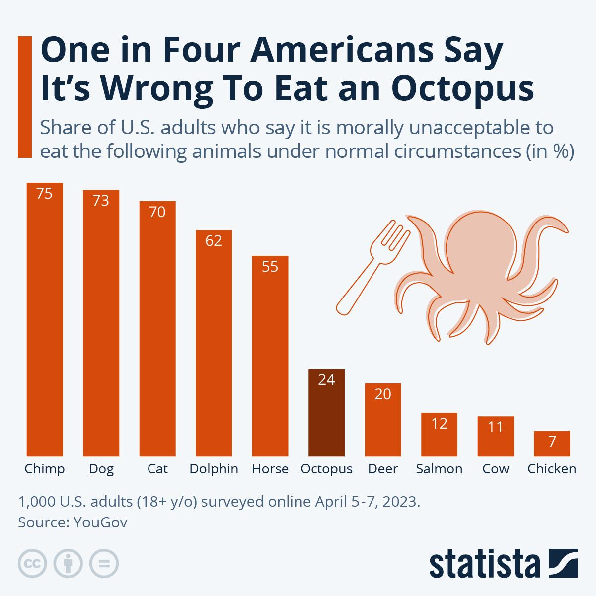

# One in Four Americans Say It's Wrong To Eat an Octopus

**Data (data.world):** [https://data.world/makeovermonday/one-in-four-americans-say-its-wrong-to-eat-an-octopus](https://data.world/makeovermonday/one-in-four-americans-say-its-wrong-to-eat-an-octopus)

**Article / original viz:** [https://www.statista.com/chart/30299/us-survey-on-ethics-of-eating-animals/](https://www.statista.com/chart/30299/us-survey-on-ethics-of-eating-animals/)

**Original data source:** [https://d3nkl3psvxxpe9.cloudfront.net/documents/results_Vegetarianism_and_Eating_Meat.pdf](https://d3nkl3psvxxpe9.cloudfront.net/documents/results_Vegetarianism_and_Eating_Meat.pdf)

**Dataset:** `makeovermonday/one-in-four-americans-say-its-wrong-to-eat-an-octopus`  
**Last updated on data.world:** 2024-02-12T01:18:16.211314192Z

---

Share of U.S. Adults that say it is wrong to eat certain animals

---
{"editor":"simple"}
---
# **Original Visualization**
​

​

ARTICLE: [https://www.statista.com/chart/30299/us-survey-on-ethics-of-eating-animals/](https://www.statista.com/chart/30299/us-survey-on-ethics-of-eating-animals/)

#
#
​