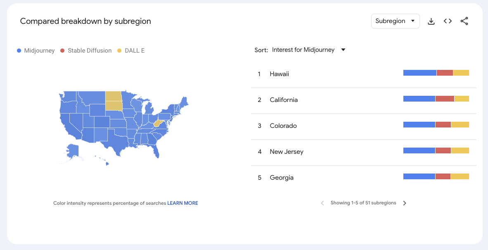

# 2024/W8 Generative AI Search Trends in the United States

**Data (data.world):** [https://data.world/makeovermonday/generative-ai-search-trends-in-the-united-states](https://data.world/makeovermonday/generative-ai-search-trends-in-the-united-states)

**Article / original viz:** [https://trends.google.com/trends/explore?date=2022-01-01%202024-02-16&geo=US&q=Midjourney,Stable%20Diffusion,DALL%20E&hl=eng](https://trends.google.com/trends/explore?date=2022-01-01%202024-02-16&geo=US&q=Midjourney,Stable%20Diffusion,DALL%20E&hl=eng)

**Original data source:** [https://trends.google.com/trends/explore?date=2022-01-01%202024-02-16&geo=US&q=Midjourney,Stable%20Diffusion,DALL%20E&hl=eng](https://trends.google.com/trends/explore?date=2022-01-01%202024-02-16&geo=US&q=Midjourney,Stable%20Diffusion,DALL%20E&hl=eng)

**Dataset:** `makeovermonday/generative-ai-search-trends-in-the-united-states`  
**Last updated on data.world:** 2024-02-18T17:52:20.127023326Z

---

US percentage of searches breakdown for the search terms ‘Midjourney’, ‘Stable Diffusion’ & ‘DALL-E’ since January 2022.

---
{"editor":"simple"}
---
# **Original Visualization**

Datasource : [Google Trends](https://trends.google.com/trends/explore?date=2022-01-01%202024-02-16&geo=US&q=Midjourney,Stable%20Diffusion,DALL%20E&hl=eng)

Article : [Google Trends](https://trends.google.com/trends/explore?date=2022-01-01%202024-02-16&geo=US&q=Midjourney,Stable%20Diffusion,DALL%20E&hl=eng)