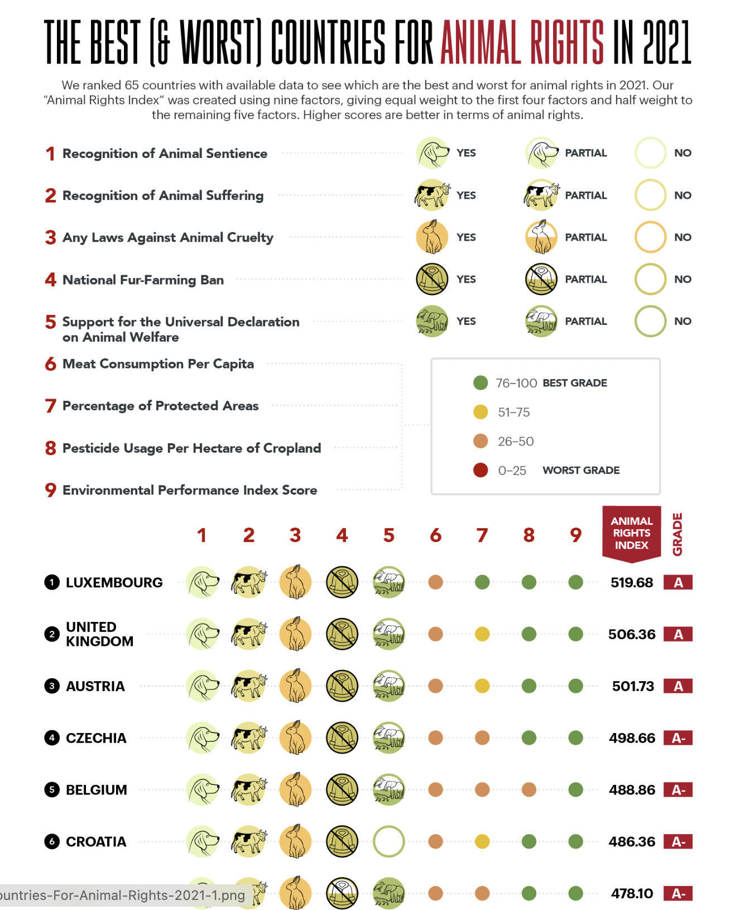

# 2024/Week 9: Animal Rights

**Data (data.world):** [https://data.world/makeovermonday/2024week-8-animal-rights](https://data.world/makeovermonday/2024week-8-animal-rights)

**Article / original viz:** [https://theswiftest.com/animal-rights-index/#:~:text=Animal%20rights%20laws%20vary%20greatly,cruelty%20any%20way%20they%20can](https://theswiftest.com/animal-rights-index/#:~:text=Animal%20rights%20laws%20vary%20greatly,cruelty%20any%20way%20they%20can)

**Original data source:** [https://theswiftest.com/animal-rights-index/#:~:text=Animal%20rights%20laws%20vary%20greatly,cruelty%20any%20way%20they%20can](https://theswiftest.com/animal-rights-index/#:~:text=Animal%20rights%20laws%20vary%20greatly,cruelty%20any%20way%20they%20can)

**Dataset:** `makeovermonday/2024week-8-animal-rights`  
**Last updated on data.world:** 2024-02-25T19:16:07.583162334Z

---

Animal Rights data

---
{"editor":"simple"}
---
​Article : [https://theswiftest.com/animal-rights-index/#:\\\~:text=Animal rights laws vary greatly,cruelty any way they can](https://theswiftest.com/animal-rights-index/#:%5C~:text=Animal%20rights%20laws%20vary%20greatly,cruelty%20any%20way%20they%20can)

​

