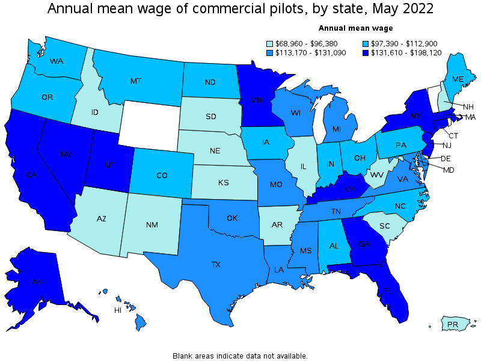

# Annual Mean Wage of Commercial Pilots

**Data (data.world):** [https://data.world/makeovermonday/employment-and-wages-of-commercial-pilots](https://data.world/makeovermonday/employment-and-wages-of-commercial-pilots)

**Article / original viz:** [https://www.bls.gov/oes/current/oes532012.htm#(9)](https://www.bls.gov/oes/current/oes532012.htm#(9))

**Original data source:** [https://data.bls.gov/oes/#/occGeo/One%20occupation%20for%20multiple%20geographical%20areas](https://data.bls.gov/oes/#/occGeo/One%20occupation%20for%20multiple%20geographical%20areas)

**Dataset:** `makeovermonday/employment-and-wages-of-commercial-pilots`  
**Last updated on data.world:** 2024-03-03T22:09:10.879072120Z

---

Occupational Employment and Wages : 53-2012 Commercial Pilots

---
{"editor":"simple"}
---
# **Original Visualization**

​

Datasource : [Occupational Employment and Wage Statistics (bls.gov)](https://data.bls.gov/oes/#/home)

Article : [Commercial Pilots (bls.gov)](https://www.bls.gov/oes/current/oes532012.htm#(9))

Data Notes: 

(1) Estimates do not include self-employed workers.     
(2) Annual wages have been calculated by multiplying the corresponding hourly wage by 2,080 hours.   
(3) The relative standard error (RSE) is a measure of the reliability of a survey statistic. The smaller the relative standard error, the more precise the   estimate.   
(9) The location quotient is the ratio of the area concentration of occupational employment to the national average concentration. A location quotient greater than one indicates the occupation has a higher share of employment than average, and a location quotient less than one indicates the occupation is less prevalent in the area than average.            

SOC code:   Standard Occupational Classification code -- see   http://www.bls.gov/soc/home.htm   
Data extracted on: Mar 03, 2024