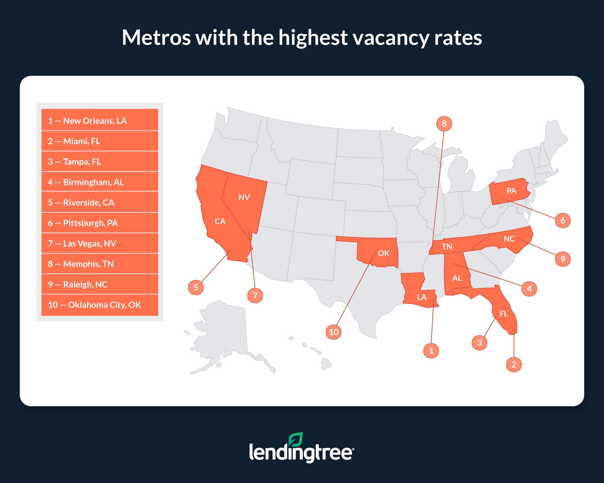

# 2024/W11 Vacant Household Rates in the United States

**Data (data.world):** [https://data.world/makeovermonday/2024w11-vacant-household-rates-in-the-united-states](https://data.world/makeovermonday/2024w11-vacant-household-rates-in-the-united-states)

**Article / original viz:** [https://www.lendingtree.com/home/mortgage/vacant-homes-metros-study/](https://www.lendingtree.com/home/mortgage/vacant-homes-metros-study/)

**Original data source:** [https://data.census.gov/table/ACSDT1Y2022.B25002?t=Housing:Housing%20Units:Vacancy&g=010XX00US$31000M1&tp=true](https://data.census.gov/table/ACSDT1Y2022.B25002?t=Housing:Housing%20Units:Vacancy&g=010XX00US$31000M1&tp=true)

**Dataset:** `makeovermonday/2024w11-vacant-household-rates-in-the-united-states`  
**Last updated on data.world:** 2024-03-10T17:59:41.159587206Z

---

Number of occupied and vacant households by US Metropolitan Statistical Area

---
{"editor":"simple"}
---
# **Original Visualization**
​

​

​

Datasource : [United States Census Bureau](https://data.census.gov/table/ACSDT1Y2022.B25002?t=Housing:Housing%20Units:Vacancy&g=010XX00US$31000M1&tp=true)

Article : [LendingTree](https://www.lendingtree.com/home/mortgage/vacant-homes-metros-study/)