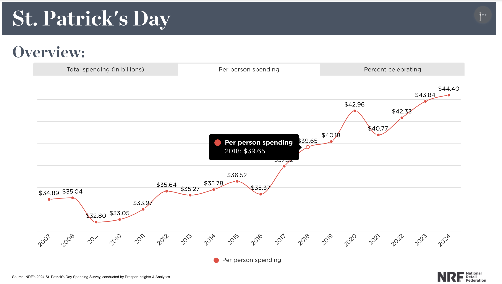

# St. Patrick Day : Spending by Person

**Data (data.world):** [https://data.world/makeovermonday/st-patrick-day-spending-by-person](https://data.world/makeovermonday/st-patrick-day-spending-by-person)

**Article / original viz:** [https://nrf.com/research-insights/holiday-data-and-trends/st-patricks-day/st-patricks-day-data-center](https://nrf.com/research-insights/holiday-data-and-trends/st-patricks-day/st-patricks-day-data-center)

**Original data source:** [https://nrf.com/research-insights/holiday-data-and-trends/st-patricks-day/st-patricks-day-data-center](https://nrf.com/research-insights/holiday-data-and-trends/st-patricks-day/st-patricks-day-data-center)

**Dataset:** `makeovermonday/st-patrick-day-spending-by-person`  
**Last updated on data.world:** 2024-03-18T00:11:45.428640147Z

---

NRF has been conducting its annual St. Patrick’s Day survey for more than a decade to see how consumers will spend for a

---
{"editor":"simple"}
---
**_Source: NRF's 2024 Annual St. Patrick's Day Spending Survey conducted by Prosper Insights & Analytics_**

[https://nrf.com/research-insights/holiday-data-and-trends/st-patricks-day/st-patricks-day-data-center](https://nrf.com/research-insights/holiday-data-and-trends/st-patricks-day/st-patricks-day-data-center)