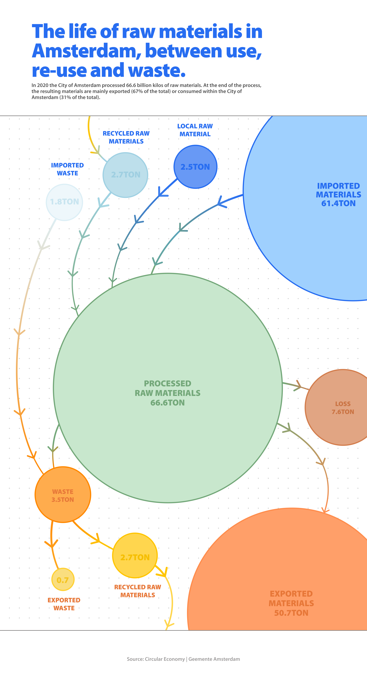

# The Life of Raw Materials in Amsterdam

**Data (data.world):** [https://data.world/makeovermonday/the-life-of-raw-materials-in-amsterdam](https://data.world/makeovermonday/the-life-of-raw-materials-in-amsterdam)

**Article / original viz:** [https://data.europa.eu/en/publications/datastories/open-data-enabler-regional-development-and-better-cohesion-europe](https://data.europa.eu/en/publications/datastories/open-data-enabler-regional-development-and-better-cohesion-europe)

**Original data source:** [https://data.europa.eu/data/datasets/aibruukx14pxug?locale=en](https://data.europa.eu/data/datasets/aibruukx14pxug?locale=en)

**Dataset:** `makeovermonday/the-life-of-raw-materials-in-amsterdam`  
**Last updated on data.world:** 2024-03-24T20:57:58.442090126Z

---

Amsterdam Analysing its Material Flows

---
{"editor":"simple"}
---
# **Original Visualization**

​

Datasource : [Material flows in Amsterdam - Data Europa EU](https://data.europa.eu/data/datasets/aibruukx14pxug?locale=en)

Article : [Open data as an enabler to regional development and better cohesion in Europe | data.europa.eu](https://data.europa.eu/en/publications/datastories/open-data-enabler-regional-development-and-better-cohesion-europe)

Data Notes: Data values in tons. Original text in dataset was translated from Dutch to English.