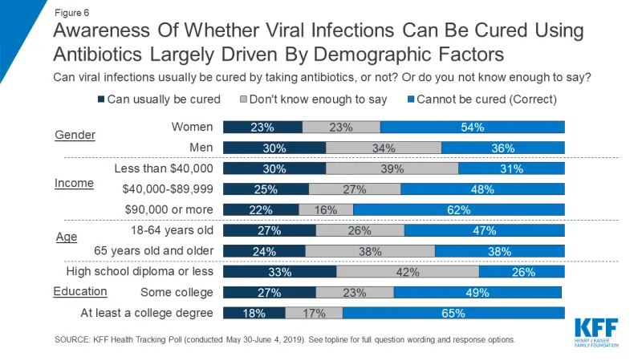

# 2024/W14 Public Awareness Around Antibiotic Resistance

**Data (data.world):** [https://data.world/makeovermonday/2024w14-public-awareness-around-antibiotic-resistance](https://data.world/makeovermonday/2024w14-public-awareness-around-antibiotic-resistance)

**Article / original viz:** [https://www.kff.org/other/issue-brief/data-note-public-awareness-antibiotic-resistance/](https://www.kff.org/other/issue-brief/data-note-public-awareness-antibiotic-resistance/)

**Original data source:** [https://www.kff.org/report-section/data-note-public-awareness-around-antibiotic-resistance-methodology/](https://www.kff.org/report-section/data-note-public-awareness-around-antibiotic-resistance-methodology/)

**Dataset:** `makeovermonday/2024w14-public-awareness-around-antibiotic-resistance`  
**Last updated on data.world:** 2024-03-31T22:55:25.610825272Z

---

Awareness of whether viral infections can be cured using antibiotics

---
{"editor":"simple"}
---
# **Original Visualization**

​

Datasource : [KFF Health Tracking Poll](https://www.kff.org/report-section/data-note-public-awareness-around-antibiotic-resistance-methodology/)

Article : [KFF - Public Awareness Around Antiobiotic Resistance](https://www.kff.org/other/issue-brief/data-note-public-awareness-antibiotic-resistance/)