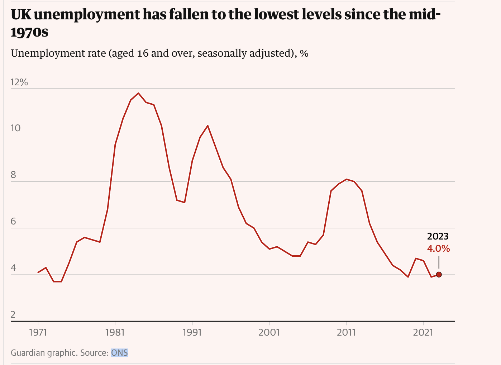

# 2024/W15 UK Unemployment rate

**Data (data.world):** [https://data.world/makeovermonday/2024-week-15-uk-unemployment-rate](https://data.world/makeovermonday/2024-week-15-uk-unemployment-rate)

**Article / original viz:** [https://www.theguardian.com/uk-news/2024/mar/02/conservatives-economic-record-budget-deficit-gdp-tax-tory-budget?utm_term=65e2ce75a55372f1c9bb099f713159bd&utm_campaign=GuardianTodayUK&utm_source=esp&utm_medium=Email&CMP=GTUK_email](https://www.theguardian.com/uk-news/2024/mar/02/conservatives-economic-record-budget-deficit-gdp-tax-tory-budget?utm_term=65e2ce75a55372f1c9bb099f713159bd&utm_campaign=GuardianTodayUK&utm_source=esp&utm_medium=Email&CMP=GTUK_email)

**Original data source:** [https://www.ons.gov.uk/employmentandlabourmarket/peoplenotinwork/unemployment/timeseries/mgsx/lms](https://www.ons.gov.uk/employmentandlabourmarket/peoplenotinwork/unemployment/timeseries/mgsx/lms)

**Dataset:** `makeovermonday/2024-week-15-uk-unemployment-rate`  
**Last updated on data.world:** 2024-04-07T18:01:28.622741730Z

---

UK unemployment has fallen to the lowest levels since the mid-1970s

---
{"editor":"simple"}
---
Article : [Guardian](https://www.theguardian.com/uk-news/2024/mar/02/conservatives-economic-record-budget-deficit-gdp-tax-tory-budget?utm%5C_term=65e2ce75a55372f1c9bb099f713159bd&utm%5C_campaign=GuardianTodayUK&utm%5C_source=esp&utm%5C_medium=Email&CMP=GTUK%5C_email)

Data: [ONS](https://www.ons.gov.uk/employmentandlabourmarket/peoplenotinwork/unemployment/timeseries/mgsx/lms)

​

