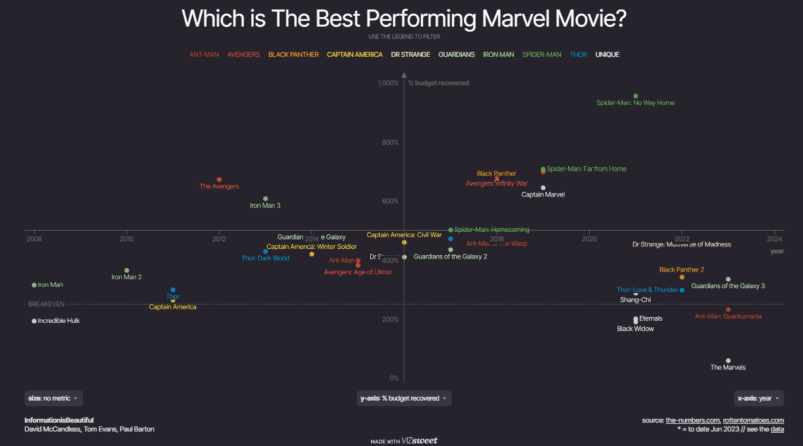

# Which is The Best Performing Marvel Movie ?

**Data (data.world):** [https://data.world/makeovermonday/what-is-the-best-performing-marvel-movie](https://data.world/makeovermonday/what-is-the-best-performing-marvel-movie)

**Article / original viz:** [https://informationisbeautiful.net/visualizations/which-is-the-best-performing-marvel-movie/](https://informationisbeautiful.net/visualizations/which-is-the-best-performing-marvel-movie/)

**Original data source:** [https://geni.us/IIB-Marvel](https://geni.us/IIB-Marvel)

**Dataset:** `makeovermonday/what-is-the-best-performing-marvel-movie`  
**Last updated on data.world:** 2024-04-14T19:57:30.826744985Z

---

The Best Performing Marvel Movie

---
{"editor":"markdown"}
---
# **Original Visualization**

# **About this Dataset**
\* SOURCE: [Information is Beautiful](https://informationisbeautiful.net/visualizations/which-is-the-best-performing-marvel-movie/)

# **Objectives**
\* What works and what doesn't work with this chart?
\* How can you make it better?
\* Share your remakes on Linkedin and/or Twitter!

Remember to tag Irene Diomi, Harry Beardon, and Chimdi Nwosu.