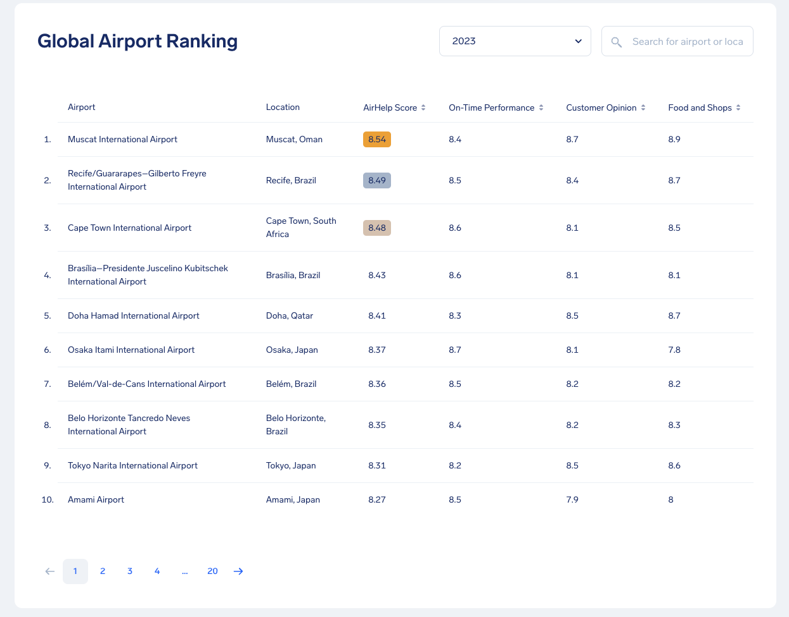

# 2024/W17 AirHelp Global Airport Rankings

**Data (data.world):** [https://data.world/makeovermonday/2024w16-airhelp-global-airport-rankings](https://data.world/makeovermonday/2024w16-airhelp-global-airport-rankings)

**Article / original viz:** [https://www.airhelp.com/en-gb/airhelp-score/airport-ranking/](https://www.airhelp.com/en-gb/airhelp-score/airport-ranking/)

**Original data source:** [https://www.airhelp.com/en-gb/blog/airhelp-score-2023-how-did-we-rank-the-airports/](https://www.airhelp.com/en-gb/blog/airhelp-score-2023-how-did-we-rank-the-airports/)

**Dataset:** `makeovermonday/2024w16-airhelp-global-airport-rankings`  
**Last updated on data.world:** 2024-04-21T15:07:07.344510622Z

---

2023 AirHelp scores for 194 of the worlds busiest airports.

---
{"editor":"simple"}
---
# **Original Visualization**

​

Datasource : [AirHelp](https://www.airhelp.com/en-gb/blog/airhelp-score-2023-how-did-we-rank-the-airports/)

Article : [Global Airport Ranking](https://www.airhelp.com/en-gb/airhelp-score/airport-ranking/)